# SNA Degrees 3_REFERENCIA DE ENVIO (var1)
Leonardo Martins  
17 de julho de 2016  
SNA Descritive Analysis from "Projeto Redes de Atenção às pessoas que consomem álcool e outras Drogas em Juiz de Fora-MG   Brazil"  - SNArRDJF

Here you can find a basic script to analysis data from SNArRDJF - this script was elaborated considering its use for orther matrix adjacency data from SNArRDJF - Here we are going to analyse:

# 3_REFERENCIA DE ENVIO (var1)

`#########################
`# Basic Preparation #####
`#########################

#Loading objects generated with previous script 

```r
rm(list = ls()) # removing previous objects to be sure that we don't have objects conflicts name
load("~/SNArRDJF/Robject/1_intro_var1.RData")
```
##Reload packages

```r
suppressMessages(library(RColorBrewer))
suppressMessages(library(car))
suppressMessages(library(xtable))
suppressMessages(library(igraph))
suppressMessages(library(miniCRAN))
suppressMessages(library(magrittr))
suppressMessages(library(keyplayer))
suppressMessages(library(dplyr))
suppressMessages(library(feather))
suppressMessages(library(visNetwork))
suppressMessages(library(knitr))
suppressMessages(library(DT))
```
##Adding phantom tools

```r
#In order to get dinamic javascript object install those ones. If you get problems installing go to Stackoverflow.com and type your error to discover what to do. In some cases the libraries need to be intalled in outside R libs.
#devtools::install_github("wch/webshot")
#webshot::install_phantomjs()
```
##Setting a random seed - this is a good strategy to keep the same graph pattern layout in a new report generation

```r
set.seed(123)
```


##Simplify Graph - removing loops and duble edges 

```r
var1<-simplify(var1) #Simplify
```


#Centrality Measures

• For undirected graphs:

– Actor centrality - involvement (connections) with other actors

• For directed graphs:

– Actor centrality - source of the ties (outgoing edges)

– Actor prestige - recipient of many ties (incoming edges)

In general - high centrality degree means direct contact with many other actors

##Centrality Degree (number of ties/nearest neighbors).

##Saving in igrpah object

```r
V(var1)$indegree<-degree(var1, mode = "in") # Actor prestige - recipient of many ties (incoming edges)
V(var1)$outdegree <- degree(var1, mode = "out") # Actor centrality - source of the ties (outgoing edges)
V(var1)$totaldegree <- degree(var1, mode = "total")
```
##Saving in Global Environment as an object

```r
var1_indegree<-degree(var1, mode = "in")
var1_outdegree<-degree(var1, mode = "out")
var1_totaldegree<-degree(var1, mode = "total")
```

#Centrality Degree Descriptive Statistics - non-normalized

##Centrality Degree Descriptive Statistics - In

```r
##in
summary(var1_indegree)
```

```
##    Min. 1st Qu.  Median    Mean 3rd Qu.    Max. 
##   0.000   2.000   4.000   6.193   6.500  94.000
```

```r
sd(var1_indegree)
```

```
## [1] 9.144324
```
##Histogram var1 degree - In

```r
hist(degree(var1, mode = "in", normalized = F), ylab="Frequency", xlab="Degree",  breaks=vcount(var1)/10, main="Histogram of Indegree Nodes - 3_REFERENCIA DE ENVIO (var1)")
```

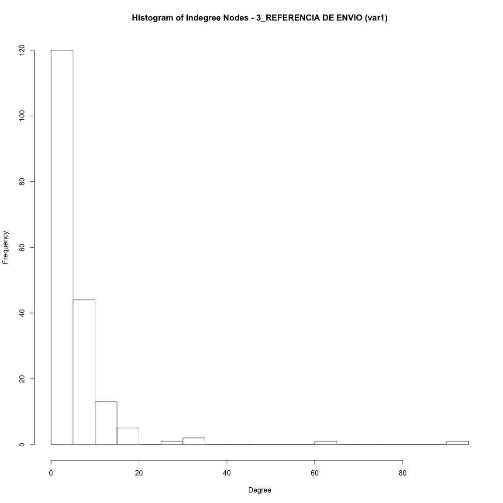<!-- -->

##Centrality Degree Descriptive Statistics - Out

```r
##out
summary(var1_outdegree)
```

```
##    Min. 1st Qu.  Median    Mean 3rd Qu.    Max. 
##   0.000   0.500   3.000   6.193   6.500  93.000
```

```r
sd(var1_outdegree)
```

```
## [1] 11.47486
```

##Histogram var1 degree - Out

```r
hist(degree(var1, mode = "out", normalized = F), ylab="Frequency", xlab="Degree",  breaks=vcount(var1)/10, main="Histogram of Outdegree Nodes - 3_REFERENCIA DE ENVIO (var1)")
```

<!-- -->

##Centrality Degree Descriptive Statistics - All

```r
##all
summary(var1_totaldegree)
```

```
##    Min. 1st Qu.  Median    Mean 3rd Qu.    Max. 
##    0.00    3.00    7.00   12.39   12.50  187.00
```

```r
sd(var1_totaldegree)
```

```
## [1] 19.25191
```
##Histogram var1 degree - All

```r
hist(degree(var1, mode = "all", normalized = F), ylab="Frequency", xlab="Degree",  breaks=vcount(var1)/10, main="Histogram of All Degree Nodes - 3_REFERENCIA DE ENVIO (var1)")
```

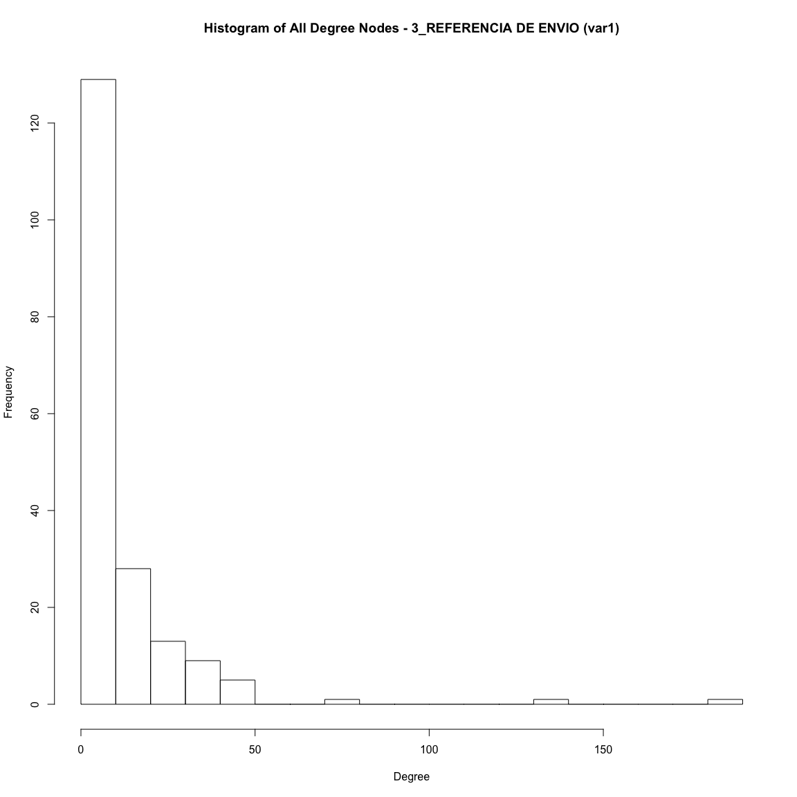<!-- -->

#Compute strength - weighted

A slightly more nuanced metric is “strength centrality”, which is defined as the sum of the weights of all the connections for a given node. This is also sometimes called “weighted degree centrality”

```r
V(var1)$var1_strength<- strength(var1, weights=E(var1)$weight)
var1_strength<- strength(var1, weights=E(var1)$weight)
```
##Strength Stats

```r
summary(var1_strength)
```

```
##    Min. 1st Qu.  Median    Mean 3rd Qu.    Max. 
##    0.00    3.00    7.00   12.39   12.50  187.00
```

```r
sd(var1_strength)
```

```
## [1] 19.25191
```
##Histogram var1 degree - All

```r
hist(strength(var1, weights=E(var1)$weight), ylab="Frequency", xlab="Degree",  breaks=vcount(var1)/10, main="Histogram of Strength Degree Nodes - 3_REFERENCIA DE ENVIO (var1)")
```

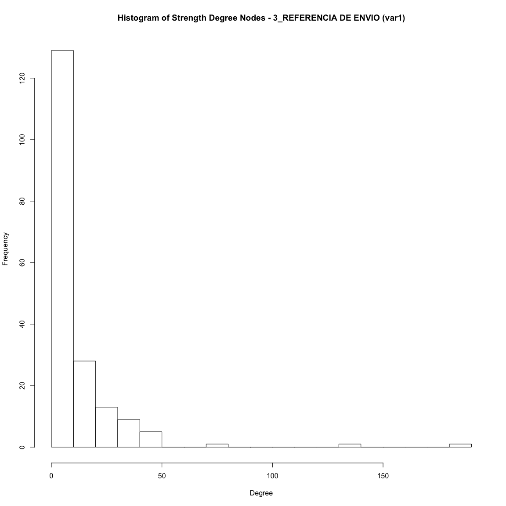<!-- -->

#Centrality Degree Normalized

##Centrality Degree Normalized saving igraph object

```r
V(var1)$indegree_n<-degree(var1, mode = "in", normalized = T)
V(var1)$outdegree_n<- degree(var1, mode = "out", normalized = T)
V(var1)$totaldegree_n<- degree(var1, mode = "total", normalized = T)
```
##Saving in Global Environment as an object

```r
var1_indegree_n<-degree(var1, mode = "in", normalized = T)
var1_outdegree_n<-degree(var1, mode = "out", normalized = T)
var1_totaldegree_n<-degree(var1, mode = "total", normalized = T)
```
##Centrality Degree Normalized Descriptive Statistics - in

```r
summary(var1_indegree_n)
```

```
##    Min. 1st Qu.  Median    Mean 3rd Qu.    Max. 
## 0.00000 0.01075 0.02151 0.03329 0.03495 0.50540
```

```r
sd(var1_indegree_n)
```

```
## [1] 0.04916303
```
##Histogram var1 degree normalized - in

```r
hist(degree(var1, mode = "in", normalized = T), ylab="Frequency", xlab="Normalized Degree",  breaks=vcount(var1)/10, main="Histogram of Normalized Indegree Nodes - 3_REFERENCIA DE ENVIO (var1)")
```

<!-- -->

##Centrality Degree Normalized Descriptive Statistics - out

```r
summary(var1_outdegree_n)
```

```
##     Min.  1st Qu.   Median     Mean  3rd Qu.     Max. 
## 0.000000 0.002688 0.016130 0.033290 0.034950 0.500000
```

```r
sd(var1_outdegree_n)
```

```
## [1] 0.0616928
```

##Histogram var1 degree normalized - out

```r
hist(degree(var1, mode = "out", normalized = T), ylab="Frequency", xlab="Normalized Degree",  breaks=vcount(var1)/10, main="Histogram of Normalized Outdegree Nodes - 3_REFERENCIA DE ENVIO (var1)")
```

<!-- -->

##Centrality Degree Normalized Descriptive Statistics - all

```r
summary(var1_totaldegree_n)
```

```
##    Min. 1st Qu.  Median    Mean 3rd Qu.    Max. 
## 0.00000 0.01613 0.03763 0.06659 0.06720 1.00500
```

```r
sd(var1_totaldegree_n)
```

```
## [1] 0.1035049
```

##Histogram var1 degree normalized - all

```r
hist(degree(var1, mode = "all", normalized = T), ylab="Frequency", xlab="Normalized Degree",  breaks=vcount(var1)/10, main="Histogram of Normalized All Degree Nodes - 3_REFERENCIA DE ENVIO (var1)")
```

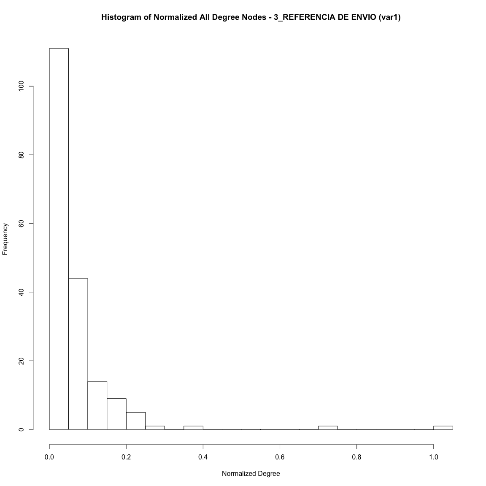<!-- -->

#Centralization Degree

```r
V(var1)$var1_centr_degree <- centralization.degree(var1)$res
var1_centr_degree <- centralization.degree(var1)
```

##Centralization

```r
var1_centr_degree$centralization
```

```
## [1] 0.4719187
```
##Theoretical Max

```r
var1_centr_degree$theoretical_max
```

```
## [1] 69192
```

#Degree distribution considering total equal one

```r
var1_degree.distribution<-degree.distribution(var1)
```

##Degree distribution Descriptive Stats

```r
summary(var1_degree.distribution)
```

```
##     Min.  1st Qu.   Median     Mean  3rd Qu.     Max. 
## 0.000000 0.000000 0.000000 0.005319 0.000000 0.133700
```

```r
sd(var1_degree.distribution)
```

```
## [1] 0.01795872
```

##Histogram var1 distribution degree

```r
hist(degree.distribution(var1), breaks=vcount(var1)/10, ylab="Frequency", xlab="Degree Distribuition", main="Histogram of Degree Distribuition - 3_REFERENCIA DE ENVIO (var1)")
```

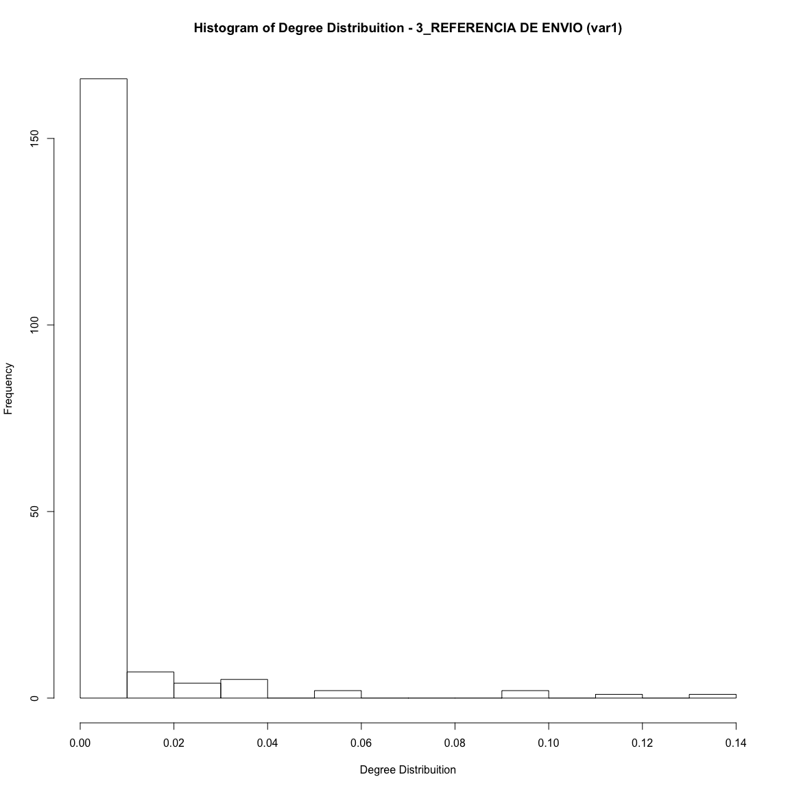<!-- -->

##Degree Probability Distribution

```r
dd <- degree.distribution(var1, cumulative=T, mode="all")
```

##Degree Probability Distribution - Plot Cumulative Frequency

```r
plot(dd, pch=19, cex=1, col="orange", xlab="Degree", ylab="Cumulative Frequency", main= "Cumulative Frequency of 3_REFERENCIA DE ENVIO (var1) ")
```

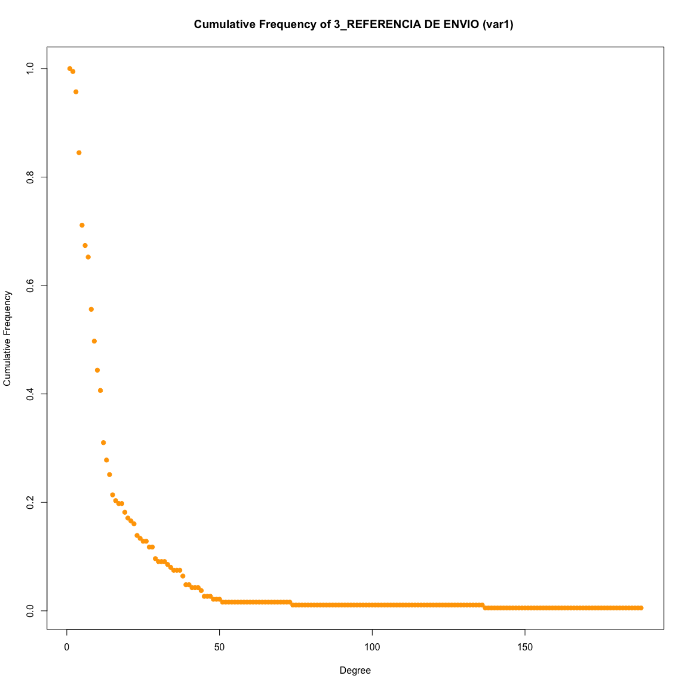<!-- -->

#Log-Log Degree Distribution - Scale Free Network - Does it fit to power law ?

```r
dd.var1 <- degree.distribution(var1)
d <- 1:max(degree(var1))-1
ind <- (dd.var1 != 0)
```

##Plot Log-Log Degree Distribution

```r
plot(d[ind], 
     dd.var1[ind], 
     log="xy", 
     col="blue",
     xlab=c("Log-Degree"), 
     ylab=c("Log-Intensity"),
     main="Log-Log Degree Distribution For 3_REFERENCIA DE ENVIO (var1)"
     )
```

<!-- -->

#Average Neighbor Degree versus Vertex Degree (log-log scale for 3_REFERENCIA DE ENVIO (var1))

The neighborhood of a given order y of a vertex v includes all vertices which are closer to v than the order. Ie. order y=0 is always v itself, order 1 is v plus its immediate neighbors, order 2 is order 1 plus the immediate neighbors of the vertices in order 1, etc.

##Average Neighbor Degree versus vertex degree (log-log scale for var1)

```r
var1_a.nn.deg <- graph.knn(var1, weights =E(var1)$weight)$knn %>% round(1)
```

##Saving to igraph object

```r
V(var1)$var1_a.nn.deg <- graph.knn(var1, weights=E(var1)$weight)$knn
```

##Table Average Neighbor Degree

```r
d<-cbind(V(var1)$LABEL_COR,var1_a.nn.deg)
datatable(d)
```

<!--html_preserve--><div id="htmlwidget-2876" style="width:100%;height:auto;" class="datatables html-widget"></div>
<script type="application/json" data-for="htmlwidget-2876">{"x":{"data":[["ASS_HOS_ Hospital de Pronto Socorro – HPS","AMB_SAM_ Centro de Atenção à Saúde Mental (CASM)","CAPS_AD","CRAS_AS_ CRAS Sudeste Costa Carvalho","CRE_SOC_ CREAS Infância e Juventude","CRE_SOC_ CREAS Norte","ASS_HOS_ Serviço de Controle e Prevenção e Tratamento do Tabagismo (SECOPTT)","EA_DQCT_ Centro de Recuperação Resgatando Vidas (Escritório)","EA_DQCT_ Comunidade Terapêutica Geração de Adoradores – CTGA","EA_DQCT_ Centro de Recuperação Resgatando Vidas","CRAS_AS_ CRAS Norte Benfica","CRAS_AS_ CRAS Centro","EA_DQCT_ Associação Beneficente Cristã Restituir","ENT_SOC_ Território Aliança pela Vida  Zona Norte","UAP_URB_ Santa Cecília","RES_TER_ Casa V1","CRE_SOC_ CREAS Idoso e Mulher","URG_EME_ Serviço de Atendimento Móvel de Urgência (SAMU)","ENT_SOC_ Associação Beneficente e Cultural Amigos do Noivo (ABAN) (Matriz)","ASS_HOS_ Centro de Referência em Álcool e Drogas (RADCAS)  Hospital Universitário","CAPS_CO_ CAPS HU","EA_DQCT_ Grupo de Apoio à Família e aos Dependentes Químicos – GAFADEQUI.1","CAPS_CO_ CAPS IJ","AJU_MUT_ Escritório de Serviços Locais dos Álcoólicos Anônimos de Juiz de Fora","ENT_SOC_ Associação Beneficente e Cultural Amigos do Noivo (ABAN) Dom Bosco","AJU_MUT_ ALANON Grupo Harmonia","AJU_MUT_ ALANON Grupo Só Por Hoje","CAPS_CO_ CAPS Leste","CRAS_AS_ CRAS Leste São Benedito","CRAS_AS_ CRAS Nordeste Grama","CRAS_AS_ CRAS Leste Linhares","UAP_URB_ Parque Guarani","ACO_INS_ Casa da Cidadania","AJU_MUT_ Grupo A.A. Vinte e Cinco de Abril","CRAS_AS_ CRAS Sudeste Olavo Costa","EA_DQCT_ Grupo de Apoio à Família e aos Dependentes Químicos – GAFADEQUI","EA_DQCT_ Centro de Recuperação Juiz de Fora Contra as Drogas","RES_TER_ Casa 1","RES_TER_ Casa 7","ENT_SOC_ Associação Casa Viva","ACO_INS_ Núcleo Cidadão de Rua Hebert de Souza","CON_RUA_ Equipe de Consultório na Rua (UAPS de referência Vila Ideal)","CON_RUA_ Equipe de Consultório na Rua (Associação Casa Viva)","EA_DQCT_ Associação Projeto Amor e Restauração – APAR","ENT_SOC_ Casa São Camilo de Lelis","CRA_SOC_ CRAS Sul Ipiranga","AJU_MUT_ Grupo A.A. Ipiranga","RES_TER_ Casa V2","RES_TER_ Casa V3","RES_TER_ Casa V4","RES_TER_ Casa V5","RES_TER_ Casa V6","EA_DQCT_ Comunidade Terapêutica Família em Cristo","UAP_URB_ São Pedro","AJU_MUT_ Grupo A.A Primeiro Passo","CRAS_AS_ CRAS Oeste São Pedro","UAP_URB_ Alto Grajaú","AJU_MUT_ Pastoral da Sobriedade","AJU_MUT_ Grupo A.A Juiz de Fora (Sala de abordagem)","ASS_HOS_ Hospital Ana Nery","AJU_MUT_ Grupo A.A. Central","EA_DQCT_ Vila Verde (Unidade Bromélias)","UAP_URB_ Santo Antônio","UAP_URB_ Grama","EA_DQCT_ Centro de Recuperação SOS Vida","EA_DQCT_ Centro de Tratamento Deville","AJU_MUT_ NARANON Grupo Parque Halfeld","ENT_SOC_ Fundação Maria Mãe","ENT_SOC_ Grupo Espírita de Ajuda aos Enfermos (GEDAE)","UAP_URB_ Cidade do Sol","UAP_URB_ Bairro Industrial","UAP_URB_ Milho Branco","UAP_URB_ Nova Era","UAP_URB_ Santa Cruz","UAP_URB_ São Judas Tadeu","UAP_URB_ Marumbí","UAP_URB_ Progresso","CRE_SOC_ CREAS População de Rua (CentroPop)","AJU_MUT_ Grupo de Apoio Benfica de Amor Exigente (GABENAE)","AJU_MUT_ Grupo de Apoio São Mateus de Amor Exigente (GASMAE)","AJU_MUT_ Grupo de Amor Exigente Linhares","AJU_MUT_ Grupo de Amor Exigente Santa Terezinha","UAP_URB_ Furtado de Menezes","AJU_MUT_ Grupo A.A. Reunidos","AJU_MUT_ Grupo de Apoio São Pedro do Amor Exigente (GASPAE)","UAP_URB_ Jóquei Clube II","EA_DQCT_ Centro Metodista de Assistência aos Toxicômanos – CEMAT","EA_DQCT_ Centro Terapêutico Reconstruir (fazenda)","UAP_URB_ Bairro de Lourdes","UAP_URB_ Vila Olavo Costa","UAP_URB_ Cruzeiro do Sul","AJU_MUT_ Igreja Batista Resplandecente Estrela do Amanhã  IBREM","EA_DQCT_ Vila Verde (Unidade Borboleta)","ASS_HOS_ Clínica Vila Verde (Hospital Dia)","UAP_URB_ Ipiranga","EA_DQCT_ Centro Metodista de Assistência aos Toxicômanos – CEMAT (Escritório)","EA_DQCT_ Centro Terapêutico Reconstruir (escritório)","EA_DQCT_ Grupo de Apoio à Família e aos Dependentes Químicos – GAFADEQUI (Administração, triagem e apoio aos familiares)","UAP_URB_ Barreira do Triunfo","ASS_HOS_ Casa de Saúde Esperança","ENT_SOC_ Associação Beneficente e Cultural Amigos do Noivo (ABAN)","ENT_SOC_ Casa de Acolhimento à Infância e Adolescente (CAIA)","RES_TER_ Casa 3","RES_TER_ Casa 4","UAP_URB_ Filgueiras","UAP_URB_ Jardim da Lua","UAP_URB_ Granjas Betânea","RES_TER_ Casa 5","RES_TER_ Casa 6","UAP_URB_ Borboleta","UAP_URB_ Santos Dumont","UAP_RUR_ Igrejinha","UAP_URB_ Dom Bosco","UAP_URB_ Benfica","UAP_URB_ Jóquei Clube I","UAP_URB_ Nossa Senhora Aparecida","UAP_URB_ Santa Cândida/São Sebastião","UAP_URB_ São Benedito","UAP_URB_ Santa Efigênia","UAP_URB_ Santa Luzia","UAP_URB_ Bandeirantes","ENT_SOC_ Instituto Veredas (Projeto, Assessoria e Prática em Saúde Mental) // Serviço de Referência para Adolescentes do Instituto Veredas","UAP_RUR_ Monte Verde","UAP_RUR_ Pirapetinga","UAP_RUR_ Torreões","UAP_RUR_ Caeté","UAP_RUR_ Chapéu D'Uvas","UAP_RUR_ Humaitá","UAP_RUR_ Rosário de Minas","UAP_RUR_ Sarandira","UAP_RUR_ Toledos","UAP_RUR_ Valadares","UAP_URB_ Esplanada","UAP_URB_ Jardim Natal","UAP_URB_ Monte Castelo","UAP_URB_ Vila Esperança","UAP_URB_ Linhares","UAP_URB_ Santa Rita","UAP_URB_ Jardim Esperança","UAP_URB_ Retiro","UAP_URB_ Vila Ideal","UAP_URB_ Teixeiras","UAP_URB_ Vale Verde","UAP_URB_ Nossa Senhora das Graças","ENT_SOC_ ONG Saída","CAPS_CO_ CAPS Casa Viva","CEN_CON_ Associação TRABALHARTE","UAP_URB_ Centro Sul","ACO_INS_ Sociedade São Vicente de Paulo","UAP_RUR_ Buiéié","UAP_RUR_ Jacutinga","UAP_RUR_ Palmital","UAP_RUR_ Pires","UAP_RUR_ Privilégio","AJU_MUT_ Grupo N.A. Glória","AJU_MUT_ Grupo A.A. 29 de Junho","UAP_RUR_ Dias Tavares","UAP_RUR_ Paula Lima","UAP_RUR_ Penido","AJU_MUT_ ALANON Grupo Libertação","AJU_MUT_ GEVE","AJU_MUT_ Grupo A.A. Libertação","AJU_MUT_ Grupo N.A. Libertação","AJU_MUT_ NARANON Grupo Glória","AJU_MUT_ Grupo A.A. Azul e Branco","AJU_MUT_ NARANON Grupo Renascer","AJU_MUT_ Grupo A.A. Cidade do Sol","AJU_MUT_ Grupo A.A. Caminho Da Salvação","AJU_MUT_ Grupo A.A. Dois de Março","AJU_MUT_ Grupo A.A. Corrente da Sobriedade","AJU_MUT_ Grupo A.A. Milho Branco","AJU_MUT_ Grupo A.A. Luz Divina","AJU_MUT_ Grupo A.A. Nova Era","AJU_MUT_ Grupo A.A União","AJU_MUT_ Grupo A.A. Bairu","AJU_MUT_ Grupo N.A. Caminho Verdade","AJU_MUT_ Grupo A.A. Bonfim","AJU_MUT_ Grupo A.A. Linhares","AJU_MUT_ Grupo A.A Redenção Abolição","AJU_MUT_ Grupo A.A. Progresso","AJU_MUT_ Grupo A.A. Estrela D´Alva","AJU_MUT_ Grupo A.A. Primeira Tradição","AJU_MUT_ Grupo A.A. Estrela do Oriente","AJU_MUT_ Grupo A.A Duas Vidas","AJU_MUT_ Grupo A.A. Liberdade","AJU_MUT_ Grupo N.A Rendição","ASS_HOS_ Hospital de Toxicômanos"],["Assistência Hospitalar","Ambulatório de Saúde Mental","CAPSAD","CRAS/CREAS","CRAS/CREAS","CRAS/CREAS","Assistência Hospitalar","Entidades Assistênciais e Dependencia Química e CT","Entidades Assistênciais e Dependencia Química e CT","Entidades Assistênciais e Dependencia Química e CT","CRAS/CREAS","CRAS/CREAS","Entidades Assistênciais e Dependencia Química e CT","Entidades Assistênciais e Dependencia Química e CT","UAPS","Residência Terapeutica","CRAS/CREAS","Urgência/Emergência","Entidades Socioassistenciais","Assistência Hospitalar","CAPS","Entidades Assistênciais e Dependencia Química e CT","CAPS","Ajuda Mútua","Entidades Socioassistenciais","Ajuda Mútua","Ajuda Mútua","CAPS","CRAS/CREAS","CRAS/CREAS","CRAS/CREAS","UAPS","Acolhimento Institucional","Ajuda Mútua","CRAS/CREAS","Entidades Assistênciais e Dependencia Química e CT","Entidades Assistênciais e Dependencia Química e CT","Residência Terapeutica","Residência Terapeutica","Entidades Socioassistenciais","Acolhimento Institucional","Consultório na Rua","Consultório na Rua","Entidades Assistênciais e Dependencia Química e CT","Entidades Socioassistenciais","CRAS/CREAS","Ajuda Mútua","Residência Terapeutica","Residência Terapeutica","Residência Terapeutica","Residência Terapeutica","Residência Terapeutica","Entidades Assistênciais e Dependencia Química e CT","UAPS","Ajuda Mútua","CRAS/CREAS","UAPS","Ajuda Mútua","Ajuda Mútua","Assistência Hospitalar","Ajuda Mútua","Entidades Assistênciais e Dependencia Química e CT","UAPS","UAPS","Entidades Assistênciais e Dependencia Química e CT","Entidades Assistênciais e Dependencia Química e CT","Ajuda Mútua","Entidades Socioassistenciais","Entidades Socioassistenciais","UAPS","UAPS","UAPS","UAPS","UAPS","UAPS","UAPS","UAPS","CRAS/CREAS","Ajuda Mútua","Ajuda Mútua","Ajuda Mútua","Ajuda Mútua","UAPS","Ajuda Mútua","Ajuda Mútua","UAPS","Entidades Assistênciais e Dependencia Química e CT","Entidades Assistênciais e Dependencia Química e CT","UAPS","UAPS","UAPS","Ajuda Mútua","Entidades Assistênciais e Dependencia Química e CT","Assistência Hospitalar","UAPS","Entidades Assistênciais e Dependencia Química e CT","Entidades Assistênciais e Dependencia Química e CT","Entidades Assistênciais e Dependencia Química e CT","UAPS","Assistência Hospitalar","Entidades Socioassistenciais","Entidades Socioassistenciais","Residência Terapeutica","Residência Terapeutica","UAPS","UAPS","UAPS","Residência Terapeutica","Residência Terapeutica","UAPS","UAPS","UAPS","UAPS","UAPS","UAPS","UAPS","UAPS","UAPS","UAPS","UAPS","UAPS","Entidades Socioassistenciais","UAPS","UAPS","UAPS","UAPS","UAPS","UAPS","UAPS","UAPS","UAPS","UAPS","UAPS","UAPS","UAPS","UAPS","UAPS","UAPS","UAPS","UAPS","UAPS","UAPS","UAPS","UAPS","Entidades Socioassistenciais","CAPS","Entidades Socioassistenciais","UAPS","Acolhimento Institucional","UAPS","UAPS","UAPS","UAPS","UAPS","Ajuda Mútua","Ajuda Mútua","UAPS","UAPS","UAPS","Ajuda Mútua","Ajuda Mútua","Ajuda Mútua","Ajuda Mútua","Ajuda Mútua","Ajuda Mútua","Ajuda Mútua","Ajuda Mútua","Ajuda Mútua","Ajuda Mútua","Ajuda Mútua","Ajuda Mútua","Ajuda Mútua","Ajuda Mútua","Ajuda Mútua","Ajuda Mútua","Ajuda Mútua","Ajuda Mútua","Ajuda Mútua","Ajuda Mútua","Ajuda Mútua","Ajuda Mútua","Ajuda Mútua","Ajuda Mútua","Ajuda Mútua","Ajuda Mútua","Ajuda Mútua","Assistência Hospitalar"],["15.9","28","16.4","31.9","33.4","18.8","21.2","25.6","74.8","39.6","26.6","36.9","22","32.1","95.1","38.4","24.7","28.2","33.1","35.6","43.6","25.4","44.7","10.8","43","112","28.5","30.7","35.4","35.6","40.8","62.3","58.8","24.7","46.7","23.9","39.6","30","50.3","27","42.4","72.8","67.6","20.7","44.8","36.2","32","40.6","40.6","40.6","40.6","40.6","71","45.7","28.3","35","63.2","37.7","4.4","47.2","43.5","5","70.4","76.1","12.1","3","1.5","47.8","40.5","109.6","96.8","63.5","75.8","73.8","61.5","67","73","40.3","10.2","10.2","10.2","10.2","81.1","33.2","20.8","83.9","44.7","52.7","70.1","104","90.8","28","5","12.3","71","55.7","12","18.7","87.4","42.3","10.7","38.5","27","27","92.2","73.4","83.4","27","27","74.2","72.2","71","73.5","92.5","91","85","79.6","81.8","82.9","56.5","112.3","38.1","100.3","136.2","100.3","93.3","135.2","93","112.6","77.7","137","102.7","92.9","135.2","99.7","72","92.4","107.8","89.5","97.7","76.8","106.2","92.1","110","98.5","34.2","29.5","80.2","25","87","120.3","87","120.3","87","33.3","24.8","83.5","118","161","29","8","25.7","18.7","24","32","2","23","32","32","23.3","25","32","25","25.3","35.7","26","25","32","25","25.7","35.3","35.3","25","30.8","27","9","NaN"]],"container":"<table class=\"display\">\n  <thead>\n    <tr>\n      <th> \u003c/th>\n      <th>V1\u003c/th>\n      <th>var1_a.nn.deg\u003c/th>\n    \u003c/tr>\n  \u003c/thead>\n\u003c/table>","options":{"order":[],"autoWidth":false,"orderClasses":false,"columnDefs":[{"orderable":false,"targets":0}]},"callback":null,"filter":"none"},"evals":[],"jsHooks":[]}</script><!--/html_preserve-->

##Plotting Average Neighbor Degree versus vertex degree

```r
plot(degree(var1), 
     var1_a.nn.deg, 
     log="xy", 
     col="goldenrod", 
     xlab=c("Log Vertex Degree"),
     ylab=c("Log Average Neighbor Degree"),
     main="Average Neighbor Degree vs Vertex Degree - Log-Log Scale for 3_REFERENCIA DE ENVIO (var1)"
     )
```

<!-- -->

#Average Weighted Neighbor Degree versus vertex degree (log-log scale for weighted 3_REFERENCIA DE ENVIO (var1))

```r
var1_a.nn.deg_w <- graph.knn(var1,V(var1), weights=E(var1)$weight)$knn %>% round(1)
```

##Saving to igraph object

```r
V(var1)$var1_a.nn.deg_w <-var1_a.nn.deg <- graph.knn(var1,V(var1), weights=E(var1)$weight)$knn
```

##Average Weighted Neighbor Descriptive

```r
summary(var1_a.nn.deg_w)
```

```
##    Min. 1st Qu.  Median    Mean 3rd Qu.    Max.    NA's 
##    1.50   27.00   40.60   52.77   79.12  161.00       1
```

```r
sd(var1_a.nn.deg_w, na.rm = T)
```

```
## [1] 33.90495
```

##Table Average Neighbor Degree Weighted

```r
d<-cbind(V(var1)$LABEL_COR,var1_a.nn.deg_w)
datatable(d)
```

<!--html_preserve--><div id="htmlwidget-7883" style="width:100%;height:auto;" class="datatables html-widget"></div>
<script type="application/json" data-for="htmlwidget-7883">{"x":{"data":[["ASS_HOS_ Hospital de Pronto Socorro – HPS","AMB_SAM_ Centro de Atenção à Saúde Mental (CASM)","CAPS_AD","CRAS_AS_ CRAS Sudeste Costa Carvalho","CRE_SOC_ CREAS Infância e Juventude","CRE_SOC_ CREAS Norte","ASS_HOS_ Serviço de Controle e Prevenção e Tratamento do Tabagismo (SECOPTT)","EA_DQCT_ Centro de Recuperação Resgatando Vidas (Escritório)","EA_DQCT_ Comunidade Terapêutica Geração de Adoradores – CTGA","EA_DQCT_ Centro de Recuperação Resgatando Vidas","CRAS_AS_ CRAS Norte Benfica","CRAS_AS_ CRAS Centro","EA_DQCT_ Associação Beneficente Cristã Restituir","ENT_SOC_ Território Aliança pela Vida  Zona Norte","UAP_URB_ Santa Cecília","RES_TER_ Casa V1","CRE_SOC_ CREAS Idoso e Mulher","URG_EME_ Serviço de Atendimento Móvel de Urgência (SAMU)","ENT_SOC_ Associação Beneficente e Cultural Amigos do Noivo (ABAN) (Matriz)","ASS_HOS_ Centro de Referência em Álcool e Drogas (RADCAS)  Hospital Universitário","CAPS_CO_ CAPS HU","EA_DQCT_ Grupo de Apoio à Família e aos Dependentes Químicos – GAFADEQUI.1","CAPS_CO_ CAPS IJ","AJU_MUT_ Escritório de Serviços Locais dos Álcoólicos Anônimos de Juiz de Fora","ENT_SOC_ Associação Beneficente e Cultural Amigos do Noivo (ABAN) Dom Bosco","AJU_MUT_ ALANON Grupo Harmonia","AJU_MUT_ ALANON Grupo Só Por Hoje","CAPS_CO_ CAPS Leste","CRAS_AS_ CRAS Leste São Benedito","CRAS_AS_ CRAS Nordeste Grama","CRAS_AS_ CRAS Leste Linhares","UAP_URB_ Parque Guarani","ACO_INS_ Casa da Cidadania","AJU_MUT_ Grupo A.A. Vinte e Cinco de Abril","CRAS_AS_ CRAS Sudeste Olavo Costa","EA_DQCT_ Grupo de Apoio à Família e aos Dependentes Químicos – GAFADEQUI","EA_DQCT_ Centro de Recuperação Juiz de Fora Contra as Drogas","RES_TER_ Casa 1","RES_TER_ Casa 7","ENT_SOC_ Associação Casa Viva","ACO_INS_ Núcleo Cidadão de Rua Hebert de Souza","CON_RUA_ Equipe de Consultório na Rua (UAPS de referência Vila Ideal)","CON_RUA_ Equipe de Consultório na Rua (Associação Casa Viva)","EA_DQCT_ Associação Projeto Amor e Restauração – APAR","ENT_SOC_ Casa São Camilo de Lelis","CRA_SOC_ CRAS Sul Ipiranga","AJU_MUT_ Grupo A.A. Ipiranga","RES_TER_ Casa V2","RES_TER_ Casa V3","RES_TER_ Casa V4","RES_TER_ Casa V5","RES_TER_ Casa V6","EA_DQCT_ Comunidade Terapêutica Família em Cristo","UAP_URB_ São Pedro","AJU_MUT_ Grupo A.A Primeiro Passo","CRAS_AS_ CRAS Oeste São Pedro","UAP_URB_ Alto Grajaú","AJU_MUT_ Pastoral da Sobriedade","AJU_MUT_ Grupo A.A Juiz de Fora (Sala de abordagem)","ASS_HOS_ Hospital Ana Nery","AJU_MUT_ Grupo A.A. Central","EA_DQCT_ Vila Verde (Unidade Bromélias)","UAP_URB_ Santo Antônio","UAP_URB_ Grama","EA_DQCT_ Centro de Recuperação SOS Vida","EA_DQCT_ Centro de Tratamento Deville","AJU_MUT_ NARANON Grupo Parque Halfeld","ENT_SOC_ Fundação Maria Mãe","ENT_SOC_ Grupo Espírita de Ajuda aos Enfermos (GEDAE)","UAP_URB_ Cidade do Sol","UAP_URB_ Bairro Industrial","UAP_URB_ Milho Branco","UAP_URB_ Nova Era","UAP_URB_ Santa Cruz","UAP_URB_ São Judas Tadeu","UAP_URB_ Marumbí","UAP_URB_ Progresso","CRE_SOC_ CREAS População de Rua (CentroPop)","AJU_MUT_ Grupo de Apoio Benfica de Amor Exigente (GABENAE)","AJU_MUT_ Grupo de Apoio São Mateus de Amor Exigente (GASMAE)","AJU_MUT_ Grupo de Amor Exigente Linhares","AJU_MUT_ Grupo de Amor Exigente Santa Terezinha","UAP_URB_ Furtado de Menezes","AJU_MUT_ Grupo A.A. Reunidos","AJU_MUT_ Grupo de Apoio São Pedro do Amor Exigente (GASPAE)","UAP_URB_ Jóquei Clube II","EA_DQCT_ Centro Metodista de Assistência aos Toxicômanos – CEMAT","EA_DQCT_ Centro Terapêutico Reconstruir (fazenda)","UAP_URB_ Bairro de Lourdes","UAP_URB_ Vila Olavo Costa","UAP_URB_ Cruzeiro do Sul","AJU_MUT_ Igreja Batista Resplandecente Estrela do Amanhã  IBREM","EA_DQCT_ Vila Verde (Unidade Borboleta)","ASS_HOS_ Clínica Vila Verde (Hospital Dia)","UAP_URB_ Ipiranga","EA_DQCT_ Centro Metodista de Assistência aos Toxicômanos – CEMAT (Escritório)","EA_DQCT_ Centro Terapêutico Reconstruir (escritório)","EA_DQCT_ Grupo de Apoio à Família e aos Dependentes Químicos – GAFADEQUI (Administração, triagem e apoio aos familiares)","UAP_URB_ Barreira do Triunfo","ASS_HOS_ Casa de Saúde Esperança","ENT_SOC_ Associação Beneficente e Cultural Amigos do Noivo (ABAN)","ENT_SOC_ Casa de Acolhimento à Infância e Adolescente (CAIA)","RES_TER_ Casa 3","RES_TER_ Casa 4","UAP_URB_ Filgueiras","UAP_URB_ Jardim da Lua","UAP_URB_ Granjas Betânea","RES_TER_ Casa 5","RES_TER_ Casa 6","UAP_URB_ Borboleta","UAP_URB_ Santos Dumont","UAP_RUR_ Igrejinha","UAP_URB_ Dom Bosco","UAP_URB_ Benfica","UAP_URB_ Jóquei Clube I","UAP_URB_ Nossa Senhora Aparecida","UAP_URB_ Santa Cândida/São Sebastião","UAP_URB_ São Benedito","UAP_URB_ Santa Efigênia","UAP_URB_ Santa Luzia","UAP_URB_ Bandeirantes","ENT_SOC_ Instituto Veredas (Projeto, Assessoria e Prática em Saúde Mental) // Serviço de Referência para Adolescentes do Instituto Veredas","UAP_RUR_ Monte Verde","UAP_RUR_ Pirapetinga","UAP_RUR_ Torreões","UAP_RUR_ Caeté","UAP_RUR_ Chapéu D'Uvas","UAP_RUR_ Humaitá","UAP_RUR_ Rosário de Minas","UAP_RUR_ Sarandira","UAP_RUR_ Toledos","UAP_RUR_ Valadares","UAP_URB_ Esplanada","UAP_URB_ Jardim Natal","UAP_URB_ Monte Castelo","UAP_URB_ Vila Esperança","UAP_URB_ Linhares","UAP_URB_ Santa Rita","UAP_URB_ Jardim Esperança","UAP_URB_ Retiro","UAP_URB_ Vila Ideal","UAP_URB_ Teixeiras","UAP_URB_ Vale Verde","UAP_URB_ Nossa Senhora das Graças","ENT_SOC_ ONG Saída","CAPS_CO_ CAPS Casa Viva","CEN_CON_ Associação TRABALHARTE","UAP_URB_ Centro Sul","ACO_INS_ Sociedade São Vicente de Paulo","UAP_RUR_ Buiéié","UAP_RUR_ Jacutinga","UAP_RUR_ Palmital","UAP_RUR_ Pires","UAP_RUR_ Privilégio","AJU_MUT_ Grupo N.A. Glória","AJU_MUT_ Grupo A.A. 29 de Junho","UAP_RUR_ Dias Tavares","UAP_RUR_ Paula Lima","UAP_RUR_ Penido","AJU_MUT_ ALANON Grupo Libertação","AJU_MUT_ GEVE","AJU_MUT_ Grupo A.A. Libertação","AJU_MUT_ Grupo N.A. Libertação","AJU_MUT_ NARANON Grupo Glória","AJU_MUT_ Grupo A.A. Azul e Branco","AJU_MUT_ NARANON Grupo Renascer","AJU_MUT_ Grupo A.A. Cidade do Sol","AJU_MUT_ Grupo A.A. Caminho Da Salvação","AJU_MUT_ Grupo A.A. Dois de Março","AJU_MUT_ Grupo A.A. Corrente da Sobriedade","AJU_MUT_ Grupo A.A. Milho Branco","AJU_MUT_ Grupo A.A. Luz Divina","AJU_MUT_ Grupo A.A. Nova Era","AJU_MUT_ Grupo A.A União","AJU_MUT_ Grupo A.A. Bairu","AJU_MUT_ Grupo N.A. Caminho Verdade","AJU_MUT_ Grupo A.A. Bonfim","AJU_MUT_ Grupo A.A. Linhares","AJU_MUT_ Grupo A.A Redenção Abolição","AJU_MUT_ Grupo A.A. Progresso","AJU_MUT_ Grupo A.A. Estrela D´Alva","AJU_MUT_ Grupo A.A. Primeira Tradição","AJU_MUT_ Grupo A.A. Estrela do Oriente","AJU_MUT_ Grupo A.A Duas Vidas","AJU_MUT_ Grupo A.A. Liberdade","AJU_MUT_ Grupo N.A Rendição","ASS_HOS_ Hospital de Toxicômanos"],["Assistência Hospitalar","Ambulatório de Saúde Mental","CAPSAD","CRAS/CREAS","CRAS/CREAS","CRAS/CREAS","Assistência Hospitalar","Entidades Assistênciais e Dependencia Química e CT","Entidades Assistênciais e Dependencia Química e CT","Entidades Assistênciais e Dependencia Química e CT","CRAS/CREAS","CRAS/CREAS","Entidades Assistênciais e Dependencia Química e CT","Entidades Assistênciais e Dependencia Química e CT","UAPS","Residência Terapeutica","CRAS/CREAS","Urgência/Emergência","Entidades Socioassistenciais","Assistência Hospitalar","CAPS","Entidades Assistênciais e Dependencia Química e CT","CAPS","Ajuda Mútua","Entidades Socioassistenciais","Ajuda Mútua","Ajuda Mútua","CAPS","CRAS/CREAS","CRAS/CREAS","CRAS/CREAS","UAPS","Acolhimento Institucional","Ajuda Mútua","CRAS/CREAS","Entidades Assistênciais e Dependencia Química e CT","Entidades Assistênciais e Dependencia Química e CT","Residência Terapeutica","Residência Terapeutica","Entidades Socioassistenciais","Acolhimento Institucional","Consultório na Rua","Consultório na Rua","Entidades Assistênciais e Dependencia Química e CT","Entidades Socioassistenciais","CRAS/CREAS","Ajuda Mútua","Residência Terapeutica","Residência Terapeutica","Residência Terapeutica","Residência Terapeutica","Residência Terapeutica","Entidades Assistênciais e Dependencia Química e CT","UAPS","Ajuda Mútua","CRAS/CREAS","UAPS","Ajuda Mútua","Ajuda Mútua","Assistência Hospitalar","Ajuda Mútua","Entidades Assistênciais e Dependencia Química e CT","UAPS","UAPS","Entidades Assistênciais e Dependencia Química e CT","Entidades Assistênciais e Dependencia Química e CT","Ajuda Mútua","Entidades Socioassistenciais","Entidades Socioassistenciais","UAPS","UAPS","UAPS","UAPS","UAPS","UAPS","UAPS","UAPS","CRAS/CREAS","Ajuda Mútua","Ajuda Mútua","Ajuda Mútua","Ajuda Mútua","UAPS","Ajuda Mútua","Ajuda Mútua","UAPS","Entidades Assistênciais e Dependencia Química e CT","Entidades Assistênciais e Dependencia Química e CT","UAPS","UAPS","UAPS","Ajuda Mútua","Entidades Assistênciais e Dependencia Química e CT","Assistência Hospitalar","UAPS","Entidades Assistênciais e Dependencia Química e CT","Entidades Assistênciais e Dependencia Química e CT","Entidades Assistênciais e Dependencia Química e CT","UAPS","Assistência Hospitalar","Entidades Socioassistenciais","Entidades Socioassistenciais","Residência Terapeutica","Residência Terapeutica","UAPS","UAPS","UAPS","Residência Terapeutica","Residência Terapeutica","UAPS","UAPS","UAPS","UAPS","UAPS","UAPS","UAPS","UAPS","UAPS","UAPS","UAPS","UAPS","Entidades Socioassistenciais","UAPS","UAPS","UAPS","UAPS","UAPS","UAPS","UAPS","UAPS","UAPS","UAPS","UAPS","UAPS","UAPS","UAPS","UAPS","UAPS","UAPS","UAPS","UAPS","UAPS","UAPS","UAPS","Entidades Socioassistenciais","CAPS","Entidades Socioassistenciais","UAPS","Acolhimento Institucional","UAPS","UAPS","UAPS","UAPS","UAPS","Ajuda Mútua","Ajuda Mútua","UAPS","UAPS","UAPS","Ajuda Mútua","Ajuda Mútua","Ajuda Mútua","Ajuda Mútua","Ajuda Mútua","Ajuda Mútua","Ajuda Mútua","Ajuda Mútua","Ajuda Mútua","Ajuda Mútua","Ajuda Mútua","Ajuda Mútua","Ajuda Mútua","Ajuda Mútua","Ajuda Mútua","Ajuda Mútua","Ajuda Mútua","Ajuda Mútua","Ajuda Mútua","Ajuda Mútua","Ajuda Mútua","Ajuda Mútua","Ajuda Mútua","Ajuda Mútua","Ajuda Mútua","Ajuda Mútua","Ajuda Mútua","Assistência Hospitalar"],["15.9","28","16.4","31.9","33.4","18.8","21.2","25.6","74.8","39.6","26.6","36.9","22","32.1","95.1","38.4","24.7","28.2","33.1","35.6","43.6","25.4","44.7","10.8","43","112","28.5","30.7","35.4","35.6","40.8","62.3","58.8","24.7","46.7","23.9","39.6","30","50.3","27","42.4","72.8","67.6","20.7","44.8","36.2","32","40.6","40.6","40.6","40.6","40.6","71","45.7","28.3","35","63.2","37.7","4.4","47.2","43.5","5","70.4","76.1","12.1","3","1.5","47.8","40.5","109.6","96.8","63.5","75.8","73.8","61.5","67","73","40.3","10.2","10.2","10.2","10.2","81.1","33.2","20.8","83.9","44.7","52.7","70.1","104","90.8","28","5","12.3","71","55.7","12","18.7","87.4","42.3","10.7","38.5","27","27","92.2","73.4","83.4","27","27","74.2","72.2","71","73.5","92.5","91","85","79.6","81.8","82.9","56.5","112.3","38.1","100.3","136.2","100.3","93.3","135.2","93","112.6","77.7","137","102.7","92.9","135.2","99.7","72","92.4","107.8","89.5","97.7","76.8","106.2","92.1","110","98.5","34.2","29.5","80.2","25","87","120.3","87","120.3","87","33.3","24.8","83.5","118","161","29","8","25.7","18.7","24","32","2","23","32","32","23.3","25","32","25","25.3","35.7","26","25","32","25","25.7","35.3","35.3","25","30.8","27","9","NaN"]],"container":"<table class=\"display\">\n  <thead>\n    <tr>\n      <th> \u003c/th>\n      <th>V1\u003c/th>\n      <th>var1_a.nn.deg_w\u003c/th>\n    \u003c/tr>\n  \u003c/thead>\n\u003c/table>","options":{"order":[],"autoWidth":false,"orderClasses":false,"columnDefs":[{"orderable":false,"targets":0}]},"callback":null,"filter":"none"},"evals":[],"jsHooks":[]}</script><!--/html_preserve-->

##Plotting Average Neighbor Degree versus vertex degree

```r
plot(degree(var1), 
     var1_a.nn.deg, 
     log="xy", 
     col="goldenrod", 
     xlab=c("Log Vertex Degree"),
     ylab=c("Log Average Neighbor Degree"),
     main="Average Weighted Neighbor Degree vs Vertex Degree - Log-Log Scale For Weighted 3_REFERENCIA DE ENVIO (var1)"
     )
```

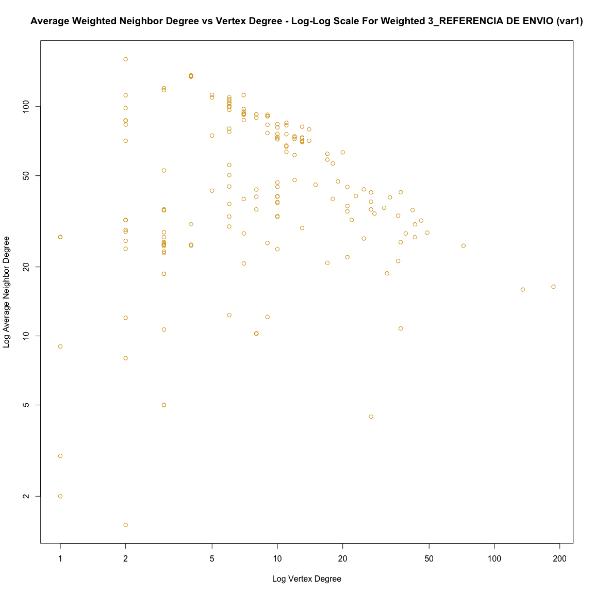<!-- -->

#Degree Centralities Dinamic Table

##Getting Degree Measures

```r
var1_indegree<-degree(var1, mode = "in")
var1_outdegree<-degree(var1, mode = "out")
var1_totaldegree<-degree(var1, mode = "total")
var1_strength<- strength(var1, weights=E(var1)$weight)
var1_indegree_n<-degree(var1, mode = "in", normalized = T) %>% round(3)
var1_outdegree_n<-degree(var1, mode = "out", normalized = T) %>% round(3)
var1_totaldegree_n<-degree(var1, mode = "total", normalized = T) %>% round(3)
var1_centr_degree <- centralization.degree(var1)$res
var1_a.nn.deg <- graph.knn(var1,V(var1))$knn %>% round(1)
var1_a.nn.deg_w <- graph.knn(var1,V(var1), weights=E(var1)$weight)$knn %>% round(1)
```

##Creating a dataframe of measures

```r
var1_df_degree <- data.frame(var1_indegree,
var1_outdegree, 
var1_totaldegree,
var1_indegree_n, 
var1_outdegree_n,
var1_totaldegree_n,
var1_strength,
var1_centr_degree,
var1_a.nn.deg,
var1_a.nn.deg_w) %>% round(3)

#Adding type
var1_df_degree <-cbind(var1_df_degree, V(var1)$LABEL_COR)

#Adding names
names(var1_df_degree) <- c("In Degree", "Out Degree", "Total Degree","In Degree Normalized", "Out Degree Normalized", "Total Degree Normalized", "Strength","Centralization Degree","Average Neighbor Degree","Average Weighted Neighbor Degree","Type")

#Ordering Variables
var1_df_degree<-var1_df_degree[c("Type","In Degree", "Out Degree", "Total Degree","In Degree Normalized", "Out Degree Normalized", "Total Degree Normalized", "Strength","Centralization Degree","Average Neighbor Degree","Average Weighted Neighbor Degree")]
```

##General tabel - DT

```r
datatable(var1_df_degree, filter = 'top')
```

<!--html_preserve--><div id="htmlwidget-4090" style="width:100%;height:auto;" class="datatables html-widget"></div>
<script type="application/json" data-for="htmlwidget-4090">{"x":{"data":[["ASS_HOS_ Hospital de Pronto Socorro – HPS","AMB_SAM_ Centro de Atenção à Saúde Mental (CASM)","CAPS_AD","CRAS_AS_ CRAS Sudeste Costa Carvalho","CRE_SOC_ CREAS Infância e Juventude","CRE_SOC_ CREAS Norte","ASS_HOS_ Serviço de Controle e Prevenção e Tratamento do Tabagismo (SECOPTT)","EA_DQCT_ Centro de Recuperação Resgatando Vidas (Escritório)","EA_DQCT_ Comunidade Terapêutica Geração de Adoradores – CTGA","EA_DQCT_ Centro de Recuperação Resgatando Vidas","CRAS_AS_ CRAS Norte Benfica","CRAS_AS_ CRAS Centro","EA_DQCT_ Associação Beneficente Cristã Restituir","ENT_SOC_ Território Aliança pela Vida  Zona Norte","UAP_URB_ Santa Cecília","RES_TER_ Casa V1","CRE_SOC_ CREAS Idoso e Mulher","URG_EME_ Serviço de Atendimento Móvel de Urgência (SAMU)","ENT_SOC_ Associação Beneficente e Cultural Amigos do Noivo (ABAN) (Matriz)","ASS_HOS_ Centro de Referência em Álcool e Drogas (RADCAS)  Hospital Universitário","CAPS_CO_ CAPS HU","EA_DQCT_ Grupo de Apoio à Família e aos Dependentes Químicos – GAFADEQUI.1","CAPS_CO_ CAPS IJ","AJU_MUT_ Escritório de Serviços Locais dos Álcoólicos Anônimos de Juiz de Fora","ENT_SOC_ Associação Beneficente e Cultural Amigos do Noivo (ABAN) Dom Bosco","AJU_MUT_ ALANON Grupo Harmonia","AJU_MUT_ ALANON Grupo Só Por Hoje","CAPS_CO_ CAPS Leste","CRAS_AS_ CRAS Leste São Benedito","CRAS_AS_ CRAS Nordeste Grama","CRAS_AS_ CRAS Leste Linhares","UAP_URB_ Parque Guarani","ACO_INS_ Casa da Cidadania","AJU_MUT_ Grupo A.A. Vinte e Cinco de Abril","CRAS_AS_ CRAS Sudeste Olavo Costa","EA_DQCT_ Grupo de Apoio à Família e aos Dependentes Químicos – GAFADEQUI","EA_DQCT_ Centro de Recuperação Juiz de Fora Contra as Drogas","RES_TER_ Casa 1","RES_TER_ Casa 7","ENT_SOC_ Associação Casa Viva","ACO_INS_ Núcleo Cidadão de Rua Hebert de Souza","CON_RUA_ Equipe de Consultório na Rua (UAPS de referência Vila Ideal)","CON_RUA_ Equipe de Consultório na Rua (Associação Casa Viva)","EA_DQCT_ Associação Projeto Amor e Restauração – APAR","ENT_SOC_ Casa São Camilo de Lelis","CRA_SOC_ CRAS Sul Ipiranga","AJU_MUT_ Grupo A.A. Ipiranga","RES_TER_ Casa V2","RES_TER_ Casa V3","RES_TER_ Casa V4","RES_TER_ Casa V5","RES_TER_ Casa V6","EA_DQCT_ Comunidade Terapêutica Família em Cristo","UAP_URB_ São Pedro","AJU_MUT_ Grupo A.A Primeiro Passo","CRAS_AS_ CRAS Oeste São Pedro","UAP_URB_ Alto Grajaú","AJU_MUT_ Pastoral da Sobriedade","AJU_MUT_ Grupo A.A Juiz de Fora (Sala de abordagem)","ASS_HOS_ Hospital Ana Nery","AJU_MUT_ Grupo A.A. Central","EA_DQCT_ Vila Verde (Unidade Bromélias)","UAP_URB_ Santo Antônio","UAP_URB_ Grama","EA_DQCT_ Centro de Recuperação SOS Vida","EA_DQCT_ Centro de Tratamento Deville","AJU_MUT_ NARANON Grupo Parque Halfeld","ENT_SOC_ Fundação Maria Mãe","ENT_SOC_ Grupo Espírita de Ajuda aos Enfermos (GEDAE)","UAP_URB_ Cidade do Sol","UAP_URB_ Bairro Industrial","UAP_URB_ Milho Branco","UAP_URB_ Nova Era","UAP_URB_ Santa Cruz","UAP_URB_ São Judas Tadeu","UAP_URB_ Marumbí","UAP_URB_ Progresso","CRE_SOC_ CREAS População de Rua (CentroPop)","AJU_MUT_ Grupo de Apoio Benfica de Amor Exigente (GABENAE)","AJU_MUT_ Grupo de Apoio São Mateus de Amor Exigente (GASMAE)","AJU_MUT_ Grupo de Amor Exigente Linhares","AJU_MUT_ Grupo de Amor Exigente Santa Terezinha","UAP_URB_ Furtado de Menezes","AJU_MUT_ Grupo A.A. Reunidos","AJU_MUT_ Grupo de Apoio São Pedro do Amor Exigente (GASPAE)","UAP_URB_ Jóquei Clube II","EA_DQCT_ Centro Metodista de Assistência aos Toxicômanos – CEMAT","EA_DQCT_ Centro Terapêutico Reconstruir (fazenda)","UAP_URB_ Bairro de Lourdes","UAP_URB_ Vila Olavo Costa","UAP_URB_ Cruzeiro do Sul","AJU_MUT_ Igreja Batista Resplandecente Estrela do Amanhã  IBREM","EA_DQCT_ Vila Verde (Unidade Borboleta)","ASS_HOS_ Clínica Vila Verde (Hospital Dia)","UAP_URB_ Ipiranga","EA_DQCT_ Centro Metodista de Assistência aos Toxicômanos – CEMAT (Escritório)","EA_DQCT_ Centro Terapêutico Reconstruir (escritório)","EA_DQCT_ Grupo de Apoio à Família e aos Dependentes Químicos – GAFADEQUI (Administração, triagem e apoio aos familiares)","UAP_URB_ Barreira do Triunfo","ASS_HOS_ Casa de Saúde Esperança","ENT_SOC_ Associação Beneficente e Cultural Amigos do Noivo (ABAN)","ENT_SOC_ Casa de Acolhimento à Infância e Adolescente (CAIA)","RES_TER_ Casa 3","RES_TER_ Casa 4","UAP_URB_ Filgueiras","UAP_URB_ Jardim da Lua","UAP_URB_ Granjas Betânea","RES_TER_ Casa 5","RES_TER_ Casa 6","UAP_URB_ Borboleta","UAP_URB_ Santos Dumont","UAP_RUR_ Igrejinha","UAP_URB_ Dom Bosco","UAP_URB_ Benfica","UAP_URB_ Jóquei Clube I","UAP_URB_ Nossa Senhora Aparecida","UAP_URB_ Santa Cândida/São Sebastião","UAP_URB_ São Benedito","UAP_URB_ Santa Efigênia","UAP_URB_ Santa Luzia","UAP_URB_ Bandeirantes","ENT_SOC_ Instituto Veredas (Projeto, Assessoria e Prática em Saúde Mental) // Serviço de Referência para Adolescentes do Instituto Veredas","UAP_RUR_ Monte Verde","UAP_RUR_ Pirapetinga","UAP_RUR_ Torreões","UAP_RUR_ Caeté","UAP_RUR_ Chapéu D'Uvas","UAP_RUR_ Humaitá","UAP_RUR_ Rosário de Minas","UAP_RUR_ Sarandira","UAP_RUR_ Toledos","UAP_RUR_ Valadares","UAP_URB_ Esplanada","UAP_URB_ Jardim Natal","UAP_URB_ Monte Castelo","UAP_URB_ Vila Esperança","UAP_URB_ Linhares","UAP_URB_ Santa Rita","UAP_URB_ Jardim Esperança","UAP_URB_ Retiro","UAP_URB_ Vila Ideal","UAP_URB_ Teixeiras","UAP_URB_ Vale Verde","UAP_URB_ Nossa Senhora das Graças","ENT_SOC_ ONG Saída","CAPS_CO_ CAPS Casa Viva","CEN_CON_ Associação TRABALHARTE","UAP_URB_ Centro Sul","ACO_INS_ Sociedade São Vicente de Paulo","UAP_RUR_ Buiéié","UAP_RUR_ Jacutinga","UAP_RUR_ Palmital","UAP_RUR_ Pires","UAP_RUR_ Privilégio","AJU_MUT_ Grupo N.A. Glória","AJU_MUT_ Grupo A.A. 29 de Junho","UAP_RUR_ Dias Tavares","UAP_RUR_ Paula Lima","UAP_RUR_ Penido","AJU_MUT_ ALANON Grupo Libertação","AJU_MUT_ GEVE","AJU_MUT_ Grupo A.A. Libertação","AJU_MUT_ Grupo N.A. Libertação","AJU_MUT_ NARANON Grupo Glória","AJU_MUT_ Grupo A.A. Azul e Branco","AJU_MUT_ NARANON Grupo Renascer","AJU_MUT_ Grupo A.A. Cidade do Sol","AJU_MUT_ Grupo A.A. Caminho Da Salvação","AJU_MUT_ Grupo A.A. Dois de Março","AJU_MUT_ Grupo A.A. Corrente da Sobriedade","AJU_MUT_ Grupo A.A. Milho Branco","AJU_MUT_ Grupo A.A. Luz Divina","AJU_MUT_ Grupo A.A. Nova Era","AJU_MUT_ Grupo A.A União","AJU_MUT_ Grupo A.A. Bairu","AJU_MUT_ Grupo N.A. Caminho Verdade","AJU_MUT_ Grupo A.A. Bonfim","AJU_MUT_ Grupo A.A. Linhares","AJU_MUT_ Grupo A.A Redenção Abolição","AJU_MUT_ Grupo A.A. Progresso","AJU_MUT_ Grupo A.A. Estrela D´Alva","AJU_MUT_ Grupo A.A. Primeira Tradição","AJU_MUT_ Grupo A.A. Estrela do Oriente","AJU_MUT_ Grupo A.A Duas Vidas","AJU_MUT_ Grupo A.A. Liberdade","AJU_MUT_ Grupo N.A Rendição","ASS_HOS_ Hospital de Toxicômanos"],["Assistência Hospitalar","Ambulatório de Saúde Mental","CAPSAD","CRAS/CREAS","CRAS/CREAS","CRAS/CREAS","Assistência Hospitalar","Entidades Assistênciais e Dependencia Química e CT","Entidades Assistênciais e Dependencia Química e CT","Entidades Assistênciais e Dependencia Química e CT","CRAS/CREAS","CRAS/CREAS","Entidades Assistênciais e Dependencia Química e CT","Entidades Assistênciais e Dependencia Química e CT","UAPS","Residência Terapeutica","CRAS/CREAS","Urgência/Emergência","Entidades Socioassistenciais","Assistência Hospitalar","CAPS","Entidades Assistênciais e Dependencia Química e CT","CAPS","Ajuda Mútua","Entidades Socioassistenciais","Ajuda Mútua","Ajuda Mútua","CAPS","CRAS/CREAS","CRAS/CREAS","CRAS/CREAS","UAPS","Acolhimento Institucional","Ajuda Mútua","CRAS/CREAS","Entidades Assistênciais e Dependencia Química e CT","Entidades Assistênciais e Dependencia Química e CT","Residência Terapeutica","Residência Terapeutica","Entidades Socioassistenciais","Acolhimento Institucional","Consultório na Rua","Consultório na Rua","Entidades Assistênciais e Dependencia Química e CT","Entidades Socioassistenciais","CRAS/CREAS","Ajuda Mútua","Residência Terapeutica","Residência Terapeutica","Residência Terapeutica","Residência Terapeutica","Residência Terapeutica","Entidades Assistênciais e Dependencia Química e CT","UAPS","Ajuda Mútua","CRAS/CREAS","UAPS","Ajuda Mútua","Ajuda Mútua","Assistência Hospitalar","Ajuda Mútua","Entidades Assistênciais e Dependencia Química e CT","UAPS","UAPS","Entidades Assistênciais e Dependencia Química e CT","Entidades Assistênciais e Dependencia Química e CT","Ajuda Mútua","Entidades Socioassistenciais","Entidades Socioassistenciais","UAPS","UAPS","UAPS","UAPS","UAPS","UAPS","UAPS","UAPS","CRAS/CREAS","Ajuda Mútua","Ajuda Mútua","Ajuda Mútua","Ajuda Mútua","UAPS","Ajuda Mútua","Ajuda Mútua","UAPS","Entidades Assistênciais e Dependencia Química e CT","Entidades Assistênciais e Dependencia Química e CT","UAPS","UAPS","UAPS","Ajuda Mútua","Entidades Assistênciais e Dependencia Química e CT","Assistência Hospitalar","UAPS","Entidades Assistênciais e Dependencia Química e CT","Entidades Assistênciais e Dependencia Química e CT","Entidades Assistênciais e Dependencia Química e CT","UAPS","Assistência Hospitalar","Entidades Socioassistenciais","Entidades Socioassistenciais","Residência Terapeutica","Residência Terapeutica","UAPS","UAPS","UAPS","Residência Terapeutica","Residência Terapeutica","UAPS","UAPS","UAPS","UAPS","UAPS","UAPS","UAPS","UAPS","UAPS","UAPS","UAPS","UAPS","Entidades Socioassistenciais","UAPS","UAPS","UAPS","UAPS","UAPS","UAPS","UAPS","UAPS","UAPS","UAPS","UAPS","UAPS","UAPS","UAPS","UAPS","UAPS","UAPS","UAPS","UAPS","UAPS","UAPS","UAPS","Entidades Socioassistenciais","CAPS","Entidades Socioassistenciais","UAPS","Acolhimento Institucional","UAPS","UAPS","UAPS","UAPS","UAPS","Ajuda Mútua","Ajuda Mútua","UAPS","UAPS","UAPS","Ajuda Mútua","Ajuda Mútua","Ajuda Mútua","Ajuda Mútua","Ajuda Mútua","Ajuda Mútua","Ajuda Mútua","Ajuda Mútua","Ajuda Mútua","Ajuda Mútua","Ajuda Mútua","Ajuda Mútua","Ajuda Mútua","Ajuda Mútua","Ajuda Mútua","Ajuda Mútua","Ajuda Mútua","Ajuda Mútua","Ajuda Mútua","Ajuda Mútua","Ajuda Mútua","Ajuda Mútua","Ajuda Mútua","Ajuda Mútua","Ajuda Mútua","Ajuda Mútua","Ajuda Mútua","Assistência Hospitalar"],[61,33,94,12,16,12,9,10,2,5,15,13,1,2,5,2,14,31,1,5,15,3,13,0,2,2,2,17,10,10,14,6,10,3,8,5,6,2,1,13,13,5,6,7,1,18,2,2,2,2,2,2,0,6,3,11,8,2,1,18,8,1,6,6,5,0,0,3,3,3,4,5,5,6,7,5,7,19,4,4,4,4,6,6,10,5,7,2,5,3,4,1,2,3,8,4,1,1,6,6,2,9,1,1,6,6,6,1,1,7,7,7,8,6,5,7,6,6,6,13,5,10,5,3,5,4,3,4,4,3,2,4,4,3,5,6,6,5,7,5,8,5,5,5,2,27,13,5,3,1,2,1,2,1,9,3,2,3,2,2,2,3,3,2,2,1,3,2,2,3,3,2,3,3,3,2,3,2,3,3,3,3,4,4,3,1,0],[74,6,93,34,20,20,27,27,3,2,10,8,20,20,2,8,58,18,9,3,10,6,8,37,3,0,0,26,32,17,9,11,7,0,2,5,12,4,5,30,24,5,5,0,5,13,0,8,8,8,8,8,2,9,0,10,12,4,26,1,0,2,7,4,4,1,2,9,5,2,2,6,6,4,5,6,6,14,4,4,4,4,4,0,7,5,3,1,8,3,5,6,1,3,6,2,1,2,1,21,1,18,0,0,3,7,3,0,0,5,5,6,4,2,4,4,8,7,5,5,2,0,1,1,1,3,1,3,1,3,2,2,3,1,1,4,2,1,1,2,1,1,2,1,0,1,0,1,0,1,1,1,1,1,1,1,0,0,0,0,0,0,0,0,0,0,0,0,0,0,0,0,0,0,0,0,0,0,0,0,0,0,0,0,0,0,0],[135,39,187,46,36,32,36,37,5,7,25,21,21,22,7,10,72,49,10,8,25,9,21,37,5,2,2,43,42,27,23,17,17,3,10,10,18,6,6,43,37,10,11,7,6,31,2,10,10,10,10,10,2,15,3,21,20,6,27,19,8,3,13,10,9,1,2,12,8,5,6,11,11,10,12,11,13,33,8,8,8,8,10,6,17,10,10,3,13,6,9,7,3,6,14,6,2,3,7,27,3,27,1,1,9,13,9,1,1,12,12,13,12,8,9,11,14,13,11,18,7,10,6,4,6,7,4,7,5,6,4,6,7,4,6,10,8,6,8,7,9,6,7,6,2,28,13,6,3,2,3,2,3,2,10,4,2,3,2,2,2,3,3,2,2,1,3,2,2,3,3,2,3,3,3,2,3,2,3,3,3,3,4,4,3,1,0],[0.328,0.177,0.505,0.065,0.086,0.065,0.048,0.054,0.011,0.027,0.081,0.07,0.005,0.011,0.027,0.011,0.075,0.167,0.005,0.027,0.081,0.016,0.07,0,0.011,0.011,0.011,0.091,0.054,0.054,0.075,0.032,0.054,0.016,0.043,0.027,0.032,0.011,0.005,0.07,0.07,0.027,0.032,0.038,0.005,0.097,0.011,0.011,0.011,0.011,0.011,0.011,0,0.032,0.016,0.059,0.043,0.011,0.005,0.097,0.043,0.005,0.032,0.032,0.027,0,0,0.016,0.016,0.016,0.022,0.027,0.027,0.032,0.038,0.027,0.038,0.102,0.022,0.022,0.022,0.022,0.032,0.032,0.054,0.027,0.038,0.011,0.027,0.016,0.022,0.005,0.011,0.016,0.043,0.022,0.005,0.005,0.032,0.032,0.011,0.048,0.005,0.005,0.032,0.032,0.032,0.005,0.005,0.038,0.038,0.038,0.043,0.032,0.027,0.038,0.032,0.032,0.032,0.07,0.027,0.054,0.027,0.016,0.027,0.022,0.016,0.022,0.022,0.016,0.011,0.022,0.022,0.016,0.027,0.032,0.032,0.027,0.038,0.027,0.043,0.027,0.027,0.027,0.011,0.145,0.07,0.027,0.016,0.005,0.011,0.005,0.011,0.005,0.048,0.016,0.011,0.016,0.011,0.011,0.011,0.016,0.016,0.011,0.011,0.005,0.016,0.011,0.011,0.016,0.016,0.011,0.016,0.016,0.016,0.011,0.016,0.011,0.016,0.016,0.016,0.016,0.022,0.022,0.016,0.005,0],[0.398,0.032,0.5,0.183,0.108,0.108,0.145,0.145,0.016,0.011,0.054,0.043,0.108,0.108,0.011,0.043,0.312,0.097,0.048,0.016,0.054,0.032,0.043,0.199,0.016,0,0,0.14,0.172,0.091,0.048,0.059,0.038,0,0.011,0.027,0.065,0.022,0.027,0.161,0.129,0.027,0.027,0,0.027,0.07,0,0.043,0.043,0.043,0.043,0.043,0.011,0.048,0,0.054,0.065,0.022,0.14,0.005,0,0.011,0.038,0.022,0.022,0.005,0.011,0.048,0.027,0.011,0.011,0.032,0.032,0.022,0.027,0.032,0.032,0.075,0.022,0.022,0.022,0.022,0.022,0,0.038,0.027,0.016,0.005,0.043,0.016,0.027,0.032,0.005,0.016,0.032,0.011,0.005,0.011,0.005,0.113,0.005,0.097,0,0,0.016,0.038,0.016,0,0,0.027,0.027,0.032,0.022,0.011,0.022,0.022,0.043,0.038,0.027,0.027,0.011,0,0.005,0.005,0.005,0.016,0.005,0.016,0.005,0.016,0.011,0.011,0.016,0.005,0.005,0.022,0.011,0.005,0.005,0.011,0.005,0.005,0.011,0.005,0,0.005,0,0.005,0,0.005,0.005,0.005,0.005,0.005,0.005,0.005,0,0,0,0,0,0,0,0,0,0,0,0,0,0,0,0,0,0,0,0,0,0,0,0,0,0,0,0,0,0,0],[0.726,0.21,1.005,0.247,0.194,0.172,0.194,0.199,0.027,0.038,0.134,0.113,0.113,0.118,0.038,0.054,0.387,0.263,0.054,0.043,0.134,0.048,0.113,0.199,0.027,0.011,0.011,0.231,0.226,0.145,0.124,0.091,0.091,0.016,0.054,0.054,0.097,0.032,0.032,0.231,0.199,0.054,0.059,0.038,0.032,0.167,0.011,0.054,0.054,0.054,0.054,0.054,0.011,0.081,0.016,0.113,0.108,0.032,0.145,0.102,0.043,0.016,0.07,0.054,0.048,0.005,0.011,0.065,0.043,0.027,0.032,0.059,0.059,0.054,0.065,0.059,0.07,0.177,0.043,0.043,0.043,0.043,0.054,0.032,0.091,0.054,0.054,0.016,0.07,0.032,0.048,0.038,0.016,0.032,0.075,0.032,0.011,0.016,0.038,0.145,0.016,0.145,0.005,0.005,0.048,0.07,0.048,0.005,0.005,0.065,0.065,0.07,0.065,0.043,0.048,0.059,0.075,0.07,0.059,0.097,0.038,0.054,0.032,0.022,0.032,0.038,0.022,0.038,0.027,0.032,0.022,0.032,0.038,0.022,0.032,0.054,0.043,0.032,0.043,0.038,0.048,0.032,0.038,0.032,0.011,0.151,0.07,0.032,0.016,0.011,0.016,0.011,0.016,0.011,0.054,0.022,0.011,0.016,0.011,0.011,0.011,0.016,0.016,0.011,0.011,0.005,0.016,0.011,0.011,0.016,0.016,0.011,0.016,0.016,0.016,0.011,0.016,0.011,0.016,0.016,0.016,0.016,0.022,0.022,0.016,0.005,0],[135,39,187,46,36,32,36,37,5,7,25,21,21,22,7,10,72,49,10,8,25,9,21,37,5,2,2,43,42,27,23,17,17,3,10,10,18,6,6,43,37,10,11,7,6,31,2,10,10,10,10,10,2,15,3,21,20,6,27,19,8,3,13,10,9,1,2,12,8,5,6,11,11,10,12,11,13,33,8,8,8,8,10,6,17,10,10,3,13,6,9,7,3,6,14,6,2,3,7,27,3,27,1,1,9,13,9,1,1,12,12,13,12,8,9,11,14,13,11,18,7,10,6,4,6,7,4,7,5,6,4,6,7,4,6,10,8,6,8,7,9,6,7,6,2,28,13,6,3,2,3,2,3,2,10,4,2,3,2,2,2,3,3,2,2,1,3,2,2,3,3,2,3,3,3,2,3,2,3,3,3,3,4,4,3,1,0],[135,39,187,46,36,32,36,37,5,7,25,21,21,22,7,10,72,49,10,8,25,9,21,37,5,2,2,43,42,27,23,17,17,3,10,10,18,6,6,43,37,10,11,7,6,31,2,10,10,10,10,10,2,15,3,21,20,6,27,19,8,3,13,10,9,1,2,12,8,5,6,11,11,10,12,11,13,33,8,8,8,8,10,6,17,10,10,3,13,6,9,7,3,6,14,6,2,3,7,27,3,27,1,1,9,13,9,1,1,12,12,13,12,8,9,11,14,13,11,18,7,10,6,4,6,7,4,7,5,6,4,6,7,4,6,10,8,6,8,7,9,6,7,6,2,28,13,6,3,2,3,2,3,2,10,4,2,3,2,2,2,3,3,2,2,1,3,2,2,3,3,2,3,3,3,2,3,2,3,3,3,3,4,4,3,1,0],[15.9,28,16.4,31.9,33.4,18.8,21.2,25.6,74.8,39.6,26.6,36.9,22,32.1,95.1,38.4,24.7,28.2,33.1,35.6,43.6,25.4,44.7,10.8,43,112,28.5,30.7,35.4,35.6,40.8,62.3,58.8,24.7,46.7,23.9,39.6,30,50.3,27,42.4,72.8,67.6,20.7,44.8,36.2,32,40.6,40.6,40.6,40.6,40.6,71,45.7,28.3,35,63.2,37.7,4.4,47.2,43.5,5,70.4,76.1,12.1,3,1.5,47.8,40.5,109.6,96.8,63.5,75.8,73.8,61.5,67,73,40.3,10.2,10.2,10.2,10.2,81.1,33.2,20.8,83.9,44.7,52.7,70.1,104,90.8,28,5,12.3,71,55.7,12,18.7,87.4,42.3,10.7,38.5,27,27,92.2,73.4,83.4,27,27,74.2,72.2,71,73.5,92.5,91,85,79.6,81.8,82.9,56.5,112.3,38.1,100.3,136.2,100.3,93.3,135.2,93,112.6,77.7,137,102.7,92.9,135.2,99.7,72,92.4,107.8,89.5,97.7,76.8,106.2,92.1,110,98.5,34.2,29.5,80.2,25,87,120.3,87,120.3,87,33.3,24.8,83.5,118,161,29,8,25.7,18.7,24,32,2,23,32,32,23.3,25,32,25,25.3,35.7,26,25,32,25,25.7,35.3,35.3,25,30.8,27,9,null],[15.9,28,16.4,31.9,33.4,18.8,21.2,25.6,74.8,39.6,26.6,36.9,22,32.1,95.1,38.4,24.7,28.2,33.1,35.6,43.6,25.4,44.7,10.8,43,112,28.5,30.7,35.4,35.6,40.8,62.3,58.8,24.7,46.7,23.9,39.6,30,50.3,27,42.4,72.8,67.6,20.7,44.8,36.2,32,40.6,40.6,40.6,40.6,40.6,71,45.7,28.3,35,63.2,37.7,4.4,47.2,43.5,5,70.4,76.1,12.1,3,1.5,47.8,40.5,109.6,96.8,63.5,75.8,73.8,61.5,67,73,40.3,10.2,10.2,10.2,10.2,81.1,33.2,20.8,83.9,44.7,52.7,70.1,104,90.8,28,5,12.3,71,55.7,12,18.7,87.4,42.3,10.7,38.5,27,27,92.2,73.4,83.4,27,27,74.2,72.2,71,73.5,92.5,91,85,79.6,81.8,82.9,56.5,112.3,38.1,100.3,136.2,100.3,93.3,135.2,93,112.6,77.7,137,102.7,92.9,135.2,99.7,72,92.4,107.8,89.5,97.7,76.8,106.2,92.1,110,98.5,34.2,29.5,80.2,25,87,120.3,87,120.3,87,33.3,24.8,83.5,118,161,29,8,25.7,18.7,24,32,2,23,32,32,23.3,25,32,25,25.3,35.7,26,25,32,25,25.7,35.3,35.3,25,30.8,27,9,null]],"container":"<table class=\"display\">\n  <thead>\n    <tr>\n      <th> \u003c/th>\n      <th>Type\u003c/th>\n      <th>In Degree\u003c/th>\n      <th>Out Degree\u003c/th>\n      <th>Total Degree\u003c/th>\n      <th>In Degree Normalized\u003c/th>\n      <th>Out Degree Normalized\u003c/th>\n      <th>Total Degree Normalized\u003c/th>\n      <th>Strength\u003c/th>\n      <th>Centralization Degree\u003c/th>\n      <th>Average Neighbor Degree\u003c/th>\n      <th>Average Weighted Neighbor Degree\u003c/th>\n    \u003c/tr>\n  \u003c/thead>\n\u003c/table>","options":{"columnDefs":[{"className":"dt-right","targets":[2,3,4,5,6,7,8,9,10,11]},{"orderable":false,"targets":0}],"order":[],"autoWidth":false,"orderClasses":false,"orderCellsTop":true},"callback":null,"filter":"top","filterHTML":"<tr>\n  <td>\u003c/td>\n  <td data-type=\"factor\" style=\"vertical-align: top;\">\n    <div class=\"form-group has-feedback\" style=\"margin-bottom: auto;\">\n      <input type=\"search\" placeholder=\"All\" class=\"form-control\" style=\"width: 100%;\"/>\n      <span class=\"glyphicon glyphicon-remove-circle form-control-feedback\">\u003c/span>\n    \u003c/div>\n    <div style=\"width: 100%; display: none;\">\n      <select multiple=\"multiple\" style=\"width: 100%;\">\n        <option value=\"Acolhimento Institucional\">Acolhimento Institucional\u003c/option>\n        <option value=\"Ajuda Mútua\">Ajuda Mútua\u003c/option>\n        <option value=\"Ambulatório de Saúde Mental\">Ambulatório de Saúde Mental\u003c/option>\n        <option value=\"Assistência Hospitalar\">Assistência Hospitalar\u003c/option>\n        <option value=\"CAPS\">CAPS\u003c/option>\n        <option value=\"CAPSAD\">CAPSAD\u003c/option>\n        <option value=\"Consultório na Rua\">Consultório na Rua\u003c/option>\n        <option value=\"CRAS/CREAS\">CRAS/CREAS\u003c/option>\n        <option value=\"Entidades Assistênciais e Dependencia Química e CT\">Entidades Assistênciais e Dependencia Química e CT\u003c/option>\n        <option value=\"Entidades Socioassistenciais\">Entidades Socioassistenciais\u003c/option>\n        <option value=\"Residência Terapeutica\">Residência Terapeutica\u003c/option>\n        <option value=\"UAPS\">UAPS\u003c/option>\n        <option value=\"Urgência/Emergência\">Urgência/Emergência\u003c/option>\n      \u003c/select>\n    \u003c/div>\n  \u003c/td>\n  <td data-type=\"number\" style=\"vertical-align: top;\">\n    <div class=\"form-group has-feedback\" style=\"margin-bottom: auto;\">\n      <input type=\"search\" placeholder=\"All\" class=\"form-control\" style=\"width: 100%;\"/>\n      <span class=\"glyphicon glyphicon-remove-circle form-control-feedback\">\u003c/span>\n    \u003c/div>\n    <div style=\"display: none; position: absolute; width: 200px;\">\n      <div data-min=\"0\" data-max=\"94\">\u003c/div>\n      <span style=\"float: left;\">\u003c/span>\n      <span style=\"float: right;\">\u003c/span>\n    \u003c/div>\n  \u003c/td>\n  <td data-type=\"number\" style=\"vertical-align: top;\">\n    <div class=\"form-group has-feedback\" style=\"margin-bottom: auto;\">\n      <input type=\"search\" placeholder=\"All\" class=\"form-control\" style=\"width: 100%;\"/>\n      <span class=\"glyphicon glyphicon-remove-circle form-control-feedback\">\u003c/span>\n    \u003c/div>\n    <div style=\"display: none; position: absolute; width: 200px;\">\n      <div data-min=\"0\" data-max=\"93\">\u003c/div>\n      <span style=\"float: left;\">\u003c/span>\n      <span style=\"float: right;\">\u003c/span>\n    \u003c/div>\n  \u003c/td>\n  <td data-type=\"number\" style=\"vertical-align: top;\">\n    <div class=\"form-group has-feedback\" style=\"margin-bottom: auto;\">\n      <input type=\"search\" placeholder=\"All\" class=\"form-control\" style=\"width: 100%;\"/>\n      <span class=\"glyphicon glyphicon-remove-circle form-control-feedback\">\u003c/span>\n    \u003c/div>\n    <div style=\"display: none; position: absolute; width: 200px;\">\n      <div data-min=\"0\" data-max=\"187\">\u003c/div>\n      <span style=\"float: left;\">\u003c/span>\n      <span style=\"float: right;\">\u003c/span>\n    \u003c/div>\n  \u003c/td>\n  <td data-type=\"number\" style=\"vertical-align: top;\">\n    <div class=\"form-group has-feedback\" style=\"margin-bottom: auto;\">\n      <input type=\"search\" placeholder=\"All\" class=\"form-control\" style=\"width: 100%;\"/>\n      <span class=\"glyphicon glyphicon-remove-circle form-control-feedback\">\u003c/span>\n    \u003c/div>\n    <div style=\"display: none; position: absolute; width: 200px;\">\n      <div data-min=\"0\" data-max=\"0.505\">\u003c/div>\n      <span style=\"float: left;\">\u003c/span>\n      <span style=\"float: right;\">\u003c/span>\n    \u003c/div>\n  \u003c/td>\n  <td data-type=\"number\" style=\"vertical-align: top;\">\n    <div class=\"form-group has-feedback\" style=\"margin-bottom: auto;\">\n      <input type=\"search\" placeholder=\"All\" class=\"form-control\" style=\"width: 100%;\"/>\n      <span class=\"glyphicon glyphicon-remove-circle form-control-feedback\">\u003c/span>\n    \u003c/div>\n    <div style=\"display: none; position: absolute; width: 200px;\">\n      <div data-min=\"0\" data-max=\"0.5\">\u003c/div>\n      <span style=\"float: left;\">\u003c/span>\n      <span style=\"float: right;\">\u003c/span>\n    \u003c/div>\n  \u003c/td>\n  <td data-type=\"number\" style=\"vertical-align: top;\">\n    <div class=\"form-group has-feedback\" style=\"margin-bottom: auto;\">\n      <input type=\"search\" placeholder=\"All\" class=\"form-control\" style=\"width: 100%;\"/>\n      <span class=\"glyphicon glyphicon-remove-circle form-control-feedback\">\u003c/span>\n    \u003c/div>\n    <div style=\"display: none; position: absolute; width: 200px;\">\n      <div data-min=\"0\" data-max=\"1.005\">\u003c/div>\n      <span style=\"float: left;\">\u003c/span>\n      <span style=\"float: right;\">\u003c/span>\n    \u003c/div>\n  \u003c/td>\n  <td data-type=\"number\" style=\"vertical-align: top;\">\n    <div class=\"form-group has-feedback\" style=\"margin-bottom: auto;\">\n      <input type=\"search\" placeholder=\"All\" class=\"form-control\" style=\"width: 100%;\"/>\n      <span class=\"glyphicon glyphicon-remove-circle form-control-feedback\">\u003c/span>\n    \u003c/div>\n    <div style=\"display: none; position: absolute; width: 200px;\">\n      <div data-min=\"0\" data-max=\"187\">\u003c/div>\n      <span style=\"float: left;\">\u003c/span>\n      <span style=\"float: right;\">\u003c/span>\n    \u003c/div>\n  \u003c/td>\n  <td data-type=\"number\" style=\"vertical-align: top;\">\n    <div class=\"form-group has-feedback\" style=\"margin-bottom: auto;\">\n      <input type=\"search\" placeholder=\"All\" class=\"form-control\" style=\"width: 100%;\"/>\n      <span class=\"glyphicon glyphicon-remove-circle form-control-feedback\">\u003c/span>\n    \u003c/div>\n    <div style=\"display: none; position: absolute; width: 200px;\">\n      <div data-min=\"0\" data-max=\"187\">\u003c/div>\n      <span style=\"float: left;\">\u003c/span>\n      <span style=\"float: right;\">\u003c/span>\n    \u003c/div>\n  \u003c/td>\n  <td data-type=\"number\" style=\"vertical-align: top;\">\n    <div class=\"form-group has-feedback\" style=\"margin-bottom: auto;\">\n      <input type=\"search\" placeholder=\"All\" class=\"form-control\" style=\"width: 100%;\"/>\n      <span class=\"glyphicon glyphicon-remove-circle form-control-feedback\">\u003c/span>\n    \u003c/div>\n    <div style=\"display: none; position: absolute; width: 200px;\">\n      <div data-min=\"1.5\" data-max=\"161\">\u003c/div>\n      <span style=\"float: left;\">\u003c/span>\n      <span style=\"float: right;\">\u003c/span>\n    \u003c/div>\n  \u003c/td>\n  <td data-type=\"number\" style=\"vertical-align: top;\">\n    <div class=\"form-group has-feedback\" style=\"margin-bottom: auto;\">\n      <input type=\"search\" placeholder=\"All\" class=\"form-control\" style=\"width: 100%;\"/>\n      <span class=\"glyphicon glyphicon-remove-circle form-control-feedback\">\u003c/span>\n    \u003c/div>\n    <div style=\"display: none; position: absolute; width: 200px;\">\n      <div data-min=\"1.5\" data-max=\"161\">\u003c/div>\n      <span style=\"float: left;\">\u003c/span>\n      <span style=\"float: right;\">\u003c/span>\n    \u003c/div>\n  \u003c/td>\n\u003c/tr>"},"evals":[],"jsHooks":[]}</script><!--/html_preserve-->

##Aggregating data from previous table - mean

```r
aggdata_mean <-aggregate(var1_df_degree, by=list(var1_df_degree$Type), FUN=mean, na.rm=TRUE)

#Removing Type variable
aggdata_mean<-aggdata_mean[,-c(2)]
names(aggdata_mean) <- c("Group", "In Degree(M)", "Out Degree(M)", "Total Degree(M)","In Degree Normalized(M)", "Out Degree Normalized(M)", "Total Degree Normalized(M)", "Strength(M)","Centralization Degree(M)","Average Neighbor Degree(M)","Average Weighted Neighbor Degree(M)")
```

##Aggregating data from previous table - sd

```r
aggdata_sd <-aggregate(var1_df_degree, by=list(var1_df_degree$Type), FUN=sd, na.rm=TRUE) 

#Removing Type variable
aggdata_sd<-aggdata_sd[,-c(2)]
names(aggdata_sd) <- c("Group", "In Degree(SD)", "Out Degree(SD)", "Total Degree(SD)","In Degree Normalized(SD)", "Out Degree Normalized(SD)", "Total Degree Normalized(SD)", "Strength(SD)","Centralization Degree(SD)","Average Neighbor Degree(SD)","Average Weighted Neighbor Degree(SD)")
```

##Merging mean and standart deviation

```r
total <- merge(aggdata_mean,aggdata_sd,by="Group")

#Rounding
Group<-total[,c(1)] #Keeping group
total<-total[,-c(1)] %>% round(2) #Rouding
total<-cbind(Group,total) #Binding toghter

#Organizing Variabels
total<-total[c("Group","In Degree(M)","In Degree(SD)", "Out Degree(M)", "Out Degree(SD)","Total Degree(M)", "Total Degree(SD)", "In Degree Normalized(M)", "In Degree Normalized(SD)", "Out Degree Normalized(M)", "Out Degree Normalized(SD)", "Total Degree Normalized(M)", "Total Degree Normalized(SD)", "Strength(M)","Strength(SD)", "Centralization Degree(M)","Centralization Degree(SD)","Average Neighbor Degree(M)","Average Neighbor Degree(SD)","Average Weighted Neighbor Degree(M)", "Average Weighted Neighbor Degree(SD)")]
```

##Plotting final table with round

```r
datatable(total, filter = 'top')
```

<!--html_preserve--><div id="htmlwidget-8830" style="width:100%;height:auto;" class="datatables html-widget"></div>
<script type="application/json" data-for="htmlwidget-8830">{"x":{"data":[["1","2","3","4","5","6","7","8","9","10","11","12","13"],["Acolhimento Institucional","Ajuda Mútua","Ambulatório de Saúde Mental","Assistência Hospitalar","CAPS","CAPSAD","Consultório na Rua","CRAS/CREAS","Entidades Assistênciais e Dependencia Química e CT","Entidades Socioassistenciais","Residência Terapeutica","UAPS","Urgência/Emergência"],[8.67,3,33,14.57,18,94,5.5,13.23,3.37,5.36,1.58,5.03,31],[5.13,1.96,null,21.25,6.22,null,0.71,3.22,2.77,4.84,0.51,2.03,null],[10.33,2.17,6,18.43,11.25,93,5,19,6,7.27,4.75,3.4,18],[12.34,6.66,null,26.73,10.56,null,0,14.87,7.85,9.3,3.74,2.67,null],[19,5.17,39,33,29.25,187,10.5,32.23,9.37,12.64,6.33,8.43,49],[17.09,6.57,null,46.7,9.6,null,0.71,15.26,9.18,12.13,4.21,4.09,null],[0.05,0.02,0.18,0.08,0.1,0.5,0.03,0.07,0.02,0.03,0.01,0.03,0.17],[0.03,0.01,null,0.11,0.03,null,0,0.02,0.02,0.03,0,0.01,null],[0.06,0.01,0.03,0.1,0.06,0.5,0.03,0.1,0.03,0.04,0.03,0.02,0.1],[0.07,0.04,null,0.14,0.06,null,0,0.08,0.04,0.05,0.02,0.01,null],[0.1,0.03,0.21,0.18,0.16,1,0.06,0.17,0.05,0.07,0.03,0.05,0.26],[0.09,0.04,null,0.25,0.05,null,0,0.08,0.05,0.07,0.02,0.02,null],[19,5.17,39,33,29.25,187,10.5,32.23,9.37,12.64,6.33,8.43,49],[17.09,6.57,null,46.7,9.6,null,0.71,15.26,9.18,12.13,4.21,4.09,null],[19,5.17,39,33,29.25,187,10.5,32.23,9.37,12.64,6.33,8.43,49],[17.09,6.57,null,46.7,9.6,null,0.71,15.26,9.18,12.13,4.21,4.09,null],[42.07,25.94,28,29.08,38.3,16.4,70.2,34.02,30.72,41.05,35.81,90.28,28.2],[16.9,16.38,null,14.58,6.92,null,3.68,7.32,21.39,21.67,7.84,21.57,null],[42.07,25.94,28,29.08,38.3,16.4,70.2,34.02,30.72,41.05,35.81,90.28,28.2],[16.9,16.38,null,14.58,6.92,null,3.68,7.32,21.39,21.67,7.84,21.57,null]],"container":"<table class=\"display\">\n  <thead>\n    <tr>\n      <th> \u003c/th>\n      <th>Group\u003c/th>\n      <th>In Degree(M)\u003c/th>\n      <th>In Degree(SD)\u003c/th>\n      <th>Out Degree(M)\u003c/th>\n      <th>Out Degree(SD)\u003c/th>\n      <th>Total Degree(M)\u003c/th>\n      <th>Total Degree(SD)\u003c/th>\n      <th>In Degree Normalized(M)\u003c/th>\n      <th>In Degree Normalized(SD)\u003c/th>\n      <th>Out Degree Normalized(M)\u003c/th>\n      <th>Out Degree Normalized(SD)\u003c/th>\n      <th>Total Degree Normalized(M)\u003c/th>\n      <th>Total Degree Normalized(SD)\u003c/th>\n      <th>Strength(M)\u003c/th>\n      <th>Strength(SD)\u003c/th>\n      <th>Centralization Degree(M)\u003c/th>\n      <th>Centralization Degree(SD)\u003c/th>\n      <th>Average Neighbor Degree(M)\u003c/th>\n      <th>Average Neighbor Degree(SD)\u003c/th>\n      <th>Average Weighted Neighbor Degree(M)\u003c/th>\n      <th>Average Weighted Neighbor Degree(SD)\u003c/th>\n    \u003c/tr>\n  \u003c/thead>\n\u003c/table>","options":{"columnDefs":[{"className":"dt-right","targets":[2,3,4,5,6,7,8,9,10,11,12,13,14,15,16,17,18,19,20,21]},{"orderable":false,"targets":0}],"order":[],"autoWidth":false,"orderClasses":false,"orderCellsTop":true},"callback":null,"filter":"top","filterHTML":"<tr>\n  <td>\u003c/td>\n  <td data-type=\"factor\" style=\"vertical-align: top;\">\n    <div class=\"form-group has-feedback\" style=\"margin-bottom: auto;\">\n      <input type=\"search\" placeholder=\"All\" class=\"form-control\" style=\"width: 100%;\"/>\n      <span class=\"glyphicon glyphicon-remove-circle form-control-feedback\">\u003c/span>\n    \u003c/div>\n    <div style=\"width: 100%; display: none;\">\n      <select multiple=\"multiple\" style=\"width: 100%;\">\n        <option value=\"Acolhimento Institucional\">Acolhimento Institucional\u003c/option>\n        <option value=\"Ajuda Mútua\">Ajuda Mútua\u003c/option>\n        <option value=\"Ambulatório de Saúde Mental\">Ambulatório de Saúde Mental\u003c/option>\n        <option value=\"Assistência Hospitalar\">Assistência Hospitalar\u003c/option>\n        <option value=\"CAPS\">CAPS\u003c/option>\n        <option value=\"CAPSAD\">CAPSAD\u003c/option>\n        <option value=\"Consultório na Rua\">Consultório na Rua\u003c/option>\n        <option value=\"CRAS/CREAS\">CRAS/CREAS\u003c/option>\n        <option value=\"Entidades Assistênciais e Dependencia Química e CT\">Entidades Assistênciais e Dependencia Química e CT\u003c/option>\n        <option value=\"Entidades Socioassistenciais\">Entidades Socioassistenciais\u003c/option>\n        <option value=\"Residência Terapeutica\">Residência Terapeutica\u003c/option>\n        <option value=\"UAPS\">UAPS\u003c/option>\n        <option value=\"Urgência/Emergência\">Urgência/Emergência\u003c/option>\n      \u003c/select>\n    \u003c/div>\n  \u003c/td>\n  <td data-type=\"number\" style=\"vertical-align: top;\">\n    <div class=\"form-group has-feedback\" style=\"margin-bottom: auto;\">\n      <input type=\"search\" placeholder=\"All\" class=\"form-control\" style=\"width: 100%;\"/>\n      <span class=\"glyphicon glyphicon-remove-circle form-control-feedback\">\u003c/span>\n    \u003c/div>\n    <div style=\"display: none; position: absolute; width: 200px;\">\n      <div data-min=\"1.58\" data-max=\"94\">\u003c/div>\n      <span style=\"float: left;\">\u003c/span>\n      <span style=\"float: right;\">\u003c/span>\n    \u003c/div>\n  \u003c/td>\n  <td data-type=\"number\" style=\"vertical-align: top;\">\n    <div class=\"form-group has-feedback\" style=\"margin-bottom: auto;\">\n      <input type=\"search\" placeholder=\"All\" class=\"form-control\" style=\"width: 100%;\"/>\n      <span class=\"glyphicon glyphicon-remove-circle form-control-feedback\">\u003c/span>\n    \u003c/div>\n    <div style=\"display: none; position: absolute; width: 200px;\">\n      <div data-min=\"0.51\" data-max=\"21.25\">\u003c/div>\n      <span style=\"float: left;\">\u003c/span>\n      <span style=\"float: right;\">\u003c/span>\n    \u003c/div>\n  \u003c/td>\n  <td data-type=\"number\" style=\"vertical-align: top;\">\n    <div class=\"form-group has-feedback\" style=\"margin-bottom: auto;\">\n      <input type=\"search\" placeholder=\"All\" class=\"form-control\" style=\"width: 100%;\"/>\n      <span class=\"glyphicon glyphicon-remove-circle form-control-feedback\">\u003c/span>\n    \u003c/div>\n    <div style=\"display: none; position: absolute; width: 200px;\">\n      <div data-min=\"2.17\" data-max=\"93\">\u003c/div>\n      <span style=\"float: left;\">\u003c/span>\n      <span style=\"float: right;\">\u003c/span>\n    \u003c/div>\n  \u003c/td>\n  <td data-type=\"number\" style=\"vertical-align: top;\">\n    <div class=\"form-group has-feedback\" style=\"margin-bottom: auto;\">\n      <input type=\"search\" placeholder=\"All\" class=\"form-control\" style=\"width: 100%;\"/>\n      <span class=\"glyphicon glyphicon-remove-circle form-control-feedback\">\u003c/span>\n    \u003c/div>\n    <div style=\"display: none; position: absolute; width: 200px;\">\n      <div data-min=\"0\" data-max=\"26.73\">\u003c/div>\n      <span style=\"float: left;\">\u003c/span>\n      <span style=\"float: right;\">\u003c/span>\n    \u003c/div>\n  \u003c/td>\n  <td data-type=\"number\" style=\"vertical-align: top;\">\n    <div class=\"form-group has-feedback\" style=\"margin-bottom: auto;\">\n      <input type=\"search\" placeholder=\"All\" class=\"form-control\" style=\"width: 100%;\"/>\n      <span class=\"glyphicon glyphicon-remove-circle form-control-feedback\">\u003c/span>\n    \u003c/div>\n    <div style=\"display: none; position: absolute; width: 200px;\">\n      <div data-min=\"5.17\" data-max=\"187\">\u003c/div>\n      <span style=\"float: left;\">\u003c/span>\n      <span style=\"float: right;\">\u003c/span>\n    \u003c/div>\n  \u003c/td>\n  <td data-type=\"number\" style=\"vertical-align: top;\">\n    <div class=\"form-group has-feedback\" style=\"margin-bottom: auto;\">\n      <input type=\"search\" placeholder=\"All\" class=\"form-control\" style=\"width: 100%;\"/>\n      <span class=\"glyphicon glyphicon-remove-circle form-control-feedback\">\u003c/span>\n    \u003c/div>\n    <div style=\"display: none; position: absolute; width: 200px;\">\n      <div data-min=\"0.71\" data-max=\"46.7\">\u003c/div>\n      <span style=\"float: left;\">\u003c/span>\n      <span style=\"float: right;\">\u003c/span>\n    \u003c/div>\n  \u003c/td>\n  <td data-type=\"number\" style=\"vertical-align: top;\">\n    <div class=\"form-group has-feedback\" style=\"margin-bottom: auto;\">\n      <input type=\"search\" placeholder=\"All\" class=\"form-control\" style=\"width: 100%;\"/>\n      <span class=\"glyphicon glyphicon-remove-circle form-control-feedback\">\u003c/span>\n    \u003c/div>\n    <div style=\"display: none; position: absolute; width: 200px;\">\n      <div data-min=\"0.01\" data-max=\"0.5\">\u003c/div>\n      <span style=\"float: left;\">\u003c/span>\n      <span style=\"float: right;\">\u003c/span>\n    \u003c/div>\n  \u003c/td>\n  <td data-type=\"number\" style=\"vertical-align: top;\">\n    <div class=\"form-group has-feedback\" style=\"margin-bottom: auto;\">\n      <input type=\"search\" placeholder=\"All\" class=\"form-control\" style=\"width: 100%;\"/>\n      <span class=\"glyphicon glyphicon-remove-circle form-control-feedback\">\u003c/span>\n    \u003c/div>\n    <div style=\"display: none; position: absolute; width: 200px;\">\n      <div data-min=\"0\" data-max=\"0.11\">\u003c/div>\n      <span style=\"float: left;\">\u003c/span>\n      <span style=\"float: right;\">\u003c/span>\n    \u003c/div>\n  \u003c/td>\n  <td data-type=\"number\" style=\"vertical-align: top;\">\n    <div class=\"form-group has-feedback\" style=\"margin-bottom: auto;\">\n      <input type=\"search\" placeholder=\"All\" class=\"form-control\" style=\"width: 100%;\"/>\n      <span class=\"glyphicon glyphicon-remove-circle form-control-feedback\">\u003c/span>\n    \u003c/div>\n    <div style=\"display: none; position: absolute; width: 200px;\">\n      <div data-min=\"0.01\" data-max=\"0.5\">\u003c/div>\n      <span style=\"float: left;\">\u003c/span>\n      <span style=\"float: right;\">\u003c/span>\n    \u003c/div>\n  \u003c/td>\n  <td data-type=\"number\" style=\"vertical-align: top;\">\n    <div class=\"form-group has-feedback\" style=\"margin-bottom: auto;\">\n      <input type=\"search\" placeholder=\"All\" class=\"form-control\" style=\"width: 100%;\"/>\n      <span class=\"glyphicon glyphicon-remove-circle form-control-feedback\">\u003c/span>\n    \u003c/div>\n    <div style=\"display: none; position: absolute; width: 200px;\">\n      <div data-min=\"0\" data-max=\"0.14\">\u003c/div>\n      <span style=\"float: left;\">\u003c/span>\n      <span style=\"float: right;\">\u003c/span>\n    \u003c/div>\n  \u003c/td>\n  <td data-type=\"number\" style=\"vertical-align: top;\">\n    <div class=\"form-group has-feedback\" style=\"margin-bottom: auto;\">\n      <input type=\"search\" placeholder=\"All\" class=\"form-control\" style=\"width: 100%;\"/>\n      <span class=\"glyphicon glyphicon-remove-circle form-control-feedback\">\u003c/span>\n    \u003c/div>\n    <div style=\"display: none; position: absolute; width: 200px;\">\n      <div data-min=\"0.03\" data-max=\"1\">\u003c/div>\n      <span style=\"float: left;\">\u003c/span>\n      <span style=\"float: right;\">\u003c/span>\n    \u003c/div>\n  \u003c/td>\n  <td data-type=\"number\" style=\"vertical-align: top;\">\n    <div class=\"form-group has-feedback\" style=\"margin-bottom: auto;\">\n      <input type=\"search\" placeholder=\"All\" class=\"form-control\" style=\"width: 100%;\"/>\n      <span class=\"glyphicon glyphicon-remove-circle form-control-feedback\">\u003c/span>\n    \u003c/div>\n    <div style=\"display: none; position: absolute; width: 200px;\">\n      <div data-min=\"0\" data-max=\"0.25\">\u003c/div>\n      <span style=\"float: left;\">\u003c/span>\n      <span style=\"float: right;\">\u003c/span>\n    \u003c/div>\n  \u003c/td>\n  <td data-type=\"number\" style=\"vertical-align: top;\">\n    <div class=\"form-group has-feedback\" style=\"margin-bottom: auto;\">\n      <input type=\"search\" placeholder=\"All\" class=\"form-control\" style=\"width: 100%;\"/>\n      <span class=\"glyphicon glyphicon-remove-circle form-control-feedback\">\u003c/span>\n    \u003c/div>\n    <div style=\"display: none; position: absolute; width: 200px;\">\n      <div data-min=\"5.17\" data-max=\"187\">\u003c/div>\n      <span style=\"float: left;\">\u003c/span>\n      <span style=\"float: right;\">\u003c/span>\n    \u003c/div>\n  \u003c/td>\n  <td data-type=\"number\" style=\"vertical-align: top;\">\n    <div class=\"form-group has-feedback\" style=\"margin-bottom: auto;\">\n      <input type=\"search\" placeholder=\"All\" class=\"form-control\" style=\"width: 100%;\"/>\n      <span class=\"glyphicon glyphicon-remove-circle form-control-feedback\">\u003c/span>\n    \u003c/div>\n    <div style=\"display: none; position: absolute; width: 200px;\">\n      <div data-min=\"0.71\" data-max=\"46.7\">\u003c/div>\n      <span style=\"float: left;\">\u003c/span>\n      <span style=\"float: right;\">\u003c/span>\n    \u003c/div>\n  \u003c/td>\n  <td data-type=\"number\" style=\"vertical-align: top;\">\n    <div class=\"form-group has-feedback\" style=\"margin-bottom: auto;\">\n      <input type=\"search\" placeholder=\"All\" class=\"form-control\" style=\"width: 100%;\"/>\n      <span class=\"glyphicon glyphicon-remove-circle form-control-feedback\">\u003c/span>\n    \u003c/div>\n    <div style=\"display: none; position: absolute; width: 200px;\">\n      <div data-min=\"5.17\" data-max=\"187\">\u003c/div>\n      <span style=\"float: left;\">\u003c/span>\n      <span style=\"float: right;\">\u003c/span>\n    \u003c/div>\n  \u003c/td>\n  <td data-type=\"number\" style=\"vertical-align: top;\">\n    <div class=\"form-group has-feedback\" style=\"margin-bottom: auto;\">\n      <input type=\"search\" placeholder=\"All\" class=\"form-control\" style=\"width: 100%;\"/>\n      <span class=\"glyphicon glyphicon-remove-circle form-control-feedback\">\u003c/span>\n    \u003c/div>\n    <div style=\"display: none; position: absolute; width: 200px;\">\n      <div data-min=\"0.71\" data-max=\"46.7\">\u003c/div>\n      <span style=\"float: left;\">\u003c/span>\n      <span style=\"float: right;\">\u003c/span>\n    \u003c/div>\n  \u003c/td>\n  <td data-type=\"number\" style=\"vertical-align: top;\">\n    <div class=\"form-group has-feedback\" style=\"margin-bottom: auto;\">\n      <input type=\"search\" placeholder=\"All\" class=\"form-control\" style=\"width: 100%;\"/>\n      <span class=\"glyphicon glyphicon-remove-circle form-control-feedback\">\u003c/span>\n    \u003c/div>\n    <div style=\"display: none; position: absolute; width: 200px;\">\n      <div data-min=\"16.4\" data-max=\"90.28\">\u003c/div>\n      <span style=\"float: left;\">\u003c/span>\n      <span style=\"float: right;\">\u003c/span>\n    \u003c/div>\n  \u003c/td>\n  <td data-type=\"number\" style=\"vertical-align: top;\">\n    <div class=\"form-group has-feedback\" style=\"margin-bottom: auto;\">\n      <input type=\"search\" placeholder=\"All\" class=\"form-control\" style=\"width: 100%;\"/>\n      <span class=\"glyphicon glyphicon-remove-circle form-control-feedback\">\u003c/span>\n    \u003c/div>\n    <div style=\"display: none; position: absolute; width: 200px;\">\n      <div data-min=\"3.68\" data-max=\"21.67\">\u003c/div>\n      <span style=\"float: left;\">\u003c/span>\n      <span style=\"float: right;\">\u003c/span>\n    \u003c/div>\n  \u003c/td>\n  <td data-type=\"number\" style=\"vertical-align: top;\">\n    <div class=\"form-group has-feedback\" style=\"margin-bottom: auto;\">\n      <input type=\"search\" placeholder=\"All\" class=\"form-control\" style=\"width: 100%;\"/>\n      <span class=\"glyphicon glyphicon-remove-circle form-control-feedback\">\u003c/span>\n    \u003c/div>\n    <div style=\"display: none; position: absolute; width: 200px;\">\n      <div data-min=\"16.4\" data-max=\"90.28\">\u003c/div>\n      <span style=\"float: left;\">\u003c/span>\n      <span style=\"float: right;\">\u003c/span>\n    \u003c/div>\n  \u003c/td>\n  <td data-type=\"number\" style=\"vertical-align: top;\">\n    <div class=\"form-group has-feedback\" style=\"margin-bottom: auto;\">\n      <input type=\"search\" placeholder=\"All\" class=\"form-control\" style=\"width: 100%;\"/>\n      <span class=\"glyphicon glyphicon-remove-circle form-control-feedback\">\u003c/span>\n    \u003c/div>\n    <div style=\"display: none; position: absolute; width: 200px;\">\n      <div data-min=\"3.68\" data-max=\"21.67\">\u003c/div>\n      <span style=\"float: left;\">\u003c/span>\n      <span style=\"float: right;\">\u003c/span>\n    \u003c/div>\n  \u003c/td>\n\u003c/tr>"},"evals":[],"jsHooks":[]}</script><!--/html_preserve-->

#Network plotting based only on degree measures 

```r
#Set Seed
set.seed(123)
#Plotting based only on degree measures 
edge.start <- ends(var1, es=E(var1), names=F)[,1]

# Fixing ego
minC <- rep(-Inf, vcount(var1))
maxC <- rep(Inf, vcount(var1))
minC[1] <- maxC[1] <- 0
co <- layout_with_fr(var1, niter=10000, minx=minC, maxx=maxC,miny=minC, maxy=maxC, weights = E(var1)$weight)

#PLotting
plot(var1, 
     layout=co,
     edge.color=V(var1)$color[edge.start],
     edge.arrow.size=(degree(var1)+1)/1000,
     edge.width=E(var1)$weight/10,
     edge.curved = TRUE,
     vertex.size=log((degree(var1)+2))*10,
     vertex.size=20,
     vertex.frame.color="#ffffff",
     vertex.label.color="black",
     vertex.label=get.vertex.attribute(var1,"LABEL_COR"),
     vertex.label.cex=log((degree(var1)+2))/10,
     vertex.label.dist=0,
     rescale=F,
     xlim=range(co[,1]), 
     ylim=range(co[,2]))
axis(1)
axis(2)


#Solving Problems with legend rendering 
a<-V(var1)$LABEL_COR
b<-V(var1)$color
c<-table(a,b)
d<-as.data.frame(c)
e<-subset(d, d$Freq>0)
f<-t(e$a)
g<-t(e$b)

#Adding Legend
legend(x=range(co[,1])[2], y=range(co[,2])[2],
       legend=as.character(f),
       pch=21,
       col = "#777777", 
       pt.bg=as.character(g),
       pt.cex=2,
       bty="n", 
       ncol=1,
       lty=1,
       cex = .5)

#Adding Title
  title("Network Vertex Degree Sized - 3_REFERENCIA DE ENVIO (var1)", sub = "Source: from authors ", cex = .5)
  text(x=range(co[,1])[1], y=range(co[,2])[1], labels = 
   sprintf("Median In Degree: %.2f\n Median Out Degree: %.2f",
     median(degree(var1, mode="in")), 
     median(degree(var1, mode="out"))
   ))
```

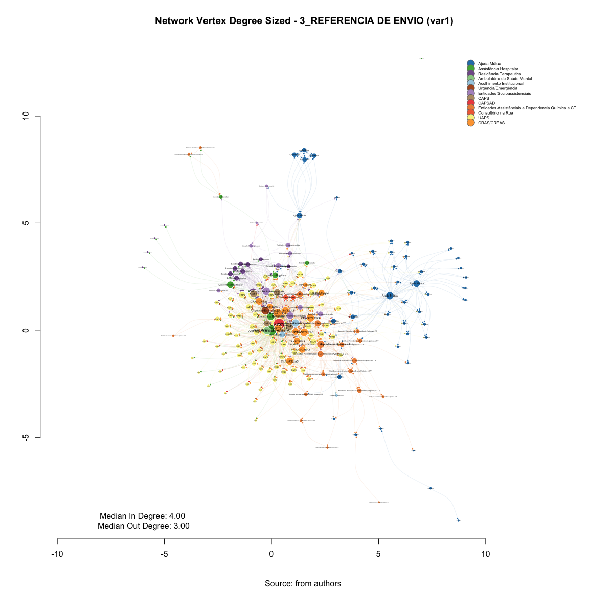<!-- -->

#Network plotting based only on degree measures 

```r
#Set Seed
set.seed(123)

#Get Variable
V(var1)$var1_color_degree<-V(var1)$totaldegree %>% round(0)

#Creating brewer pallette
vertex_var1_color_degree<-
  colorRampPalette(brewer.pal(length(unique(
          V(var1)$var1_color_degree)), "RdBu"))(
            length(unique(V(var1)$var1_color_degree)))

#Saving as Vertex properties 
V(var1)$vertex_var1_color_degree<- vertex_var1_color_degree[as.numeric(cut(degree(var1),breaks =length(unique(V(var1)$var1_color_degree))))]

set.seed(123)
#Plotting based only on degree measures 
edge.start <- ends(var1, es=E(var1), names=F)[,1]

# Fixing ego
minC <- rep(-Inf, vcount(var1))
maxC <- rep(Inf, vcount(var1))
minC[1] <- maxC[1] <- 0
co <- layout_with_fr(var1, niter=10000, minx=minC, maxx=maxC,miny=minC, maxy=maxC, weights = E(var1)$weight)

#PLotting
plot(var1, 
     layout=co,
     #edge.color=V(var1)$color[edge.start],
     edge.arrow.size=(degree(var1)+1)/1000,
     edge.width=E(var1)$weight/10,
     edge.curved = TRUE,
     vertex.color=V(var1)$vertex_var1_color_degree,
     vertex.size=log((degree(var1)+2))*10,
     vertex.size=20,
     vertex.frame.color="#ffffff",
     vertex.label.color="black",
     vertex.label=get.vertex.attribute(var1,"LABEL_COR"),
     vertex.label.cex=log((degree(var1)+2))/10,
     vertex.label.dist=0,
     rescale=F,
     xlim=range(co[,1]), 
     ylim=range(co[,2]))
axis(1)
axis(2)


#Solving Problems with legend rendering 
a<-V(var1)$var1_color_degree
b<-V(var1)$vertex_var1_color_degree
c<-table(a,b)
d<-as.data.frame(c)
e<-subset(d, d$Freq>0)
e<-e[order(e$a,decreasing=T),] 
f<-t(e$a)
g<-t(e$b)

#Adding Legend
legend(x=range(co[,1])[2], y=range(co[,2])[2],
       legend=as.character(f),
       pch=21,
       col = "#777777", 
       pt.bg=as.character(g),
       pt.cex=2,
       bty="n", 
       ncol=1,
       lty=1,
       cex = .3)

#Adding Title
  title("Network Vertex Degree Sized and Red to Blue - 3_REFERENCIA DE ENVIO (var1)", sub = "Source: from authors ")
  text(x=range(co[,1])[1], y=range(co[,2])[1], labels = 
   sprintf("Median In Degree: %.2f\nMedian Out Degree: %.2f",
     median(degree(var1, mode="in")), 
     median(degree(var1, mode="out"))
   ))
```

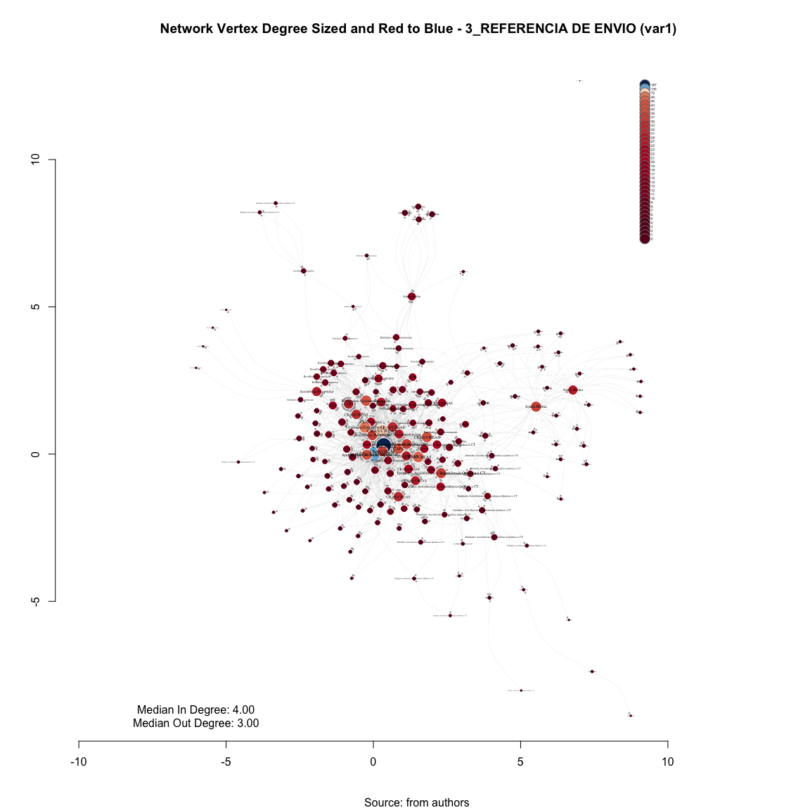<!-- -->

#Network Plotting Centralization - Degree Measures - Using Spectral Color as Distance Measure Representation

```r
#Set Seed
set.seed(123)

#Get Variable
V(var1)$var1_color_degree<-V(var1)$var1_centr_degree

#Creating brewer pallette
vertex_var1_color_degree<-
  colorRampPalette(brewer.pal(length(unique(
          V(var1)$var1_color_degree)), "Spectral"))(
            length(unique(V(var1)$var1_color_degree)))

#Saving as Vertex properties 
V(var1)$vertex_var1_color_degree<- vertex_var1_color_degree[as.numeric(cut(V(var1)$var1_color_degree,breaks =length(unique(V(var1)$var1_color_degree))))]

#Plotting based only on degree measures 
edge.start <- ends(var1, es=E(var1), names=F)[,1]

# Fixing ego
minC <- rep(-Inf, vcount(var1))
maxC <- rep(Inf, vcount(var1))
minC[1] <- maxC[1] <- 0
co <- layout_with_fr(var1, niter=10000, minx=minC, maxx=maxC,miny=minC, maxy=maxC, weights = E(var1)$weight)

#PLotting
plot(var1, 
     layout=co,
     vertex.color=V(var1)$vertex_var1_color_degree,
     edge.color=V(var1)$vertex_var1_color_degree[edge.start],
     edge.arrow.size=(degree(var1)+1)/10000,
     edge.width=E(var1)$weight/10,
     edge.curved = TRUE,
     vertex.color=V(var1)$vertex_var1_color_degree,
    vertex.size=log((V(var1)$var1_centr_degree+2))*10,
     vertex.size=20,
     vertex.frame.color="#ffffff",
     vertex.label.color="black",
     vertex.label=get.vertex.attribute(var1,"LABEL_COR"),
     vertex.label.cex=log((degree(var1)+2))/10,
     vertex.label.dist=0,
     rescale=F,
     xlim=range(co[,1]), 
     ylim=range(co[,2]))
axis(1)
axis(2)


#Solving Problems with legend rendering 
a<-V(var1)$var1_color_degree
b<-V(var1)$vertex_var1_color_degree
c<-table(a,b)
d<-as.data.frame(c)
e<-subset(d, d$Freq>0)
e<-e[order(e$a,decreasing=T),] 
f<-t(e$a)
g<-t(e$b)

#Adding Legend
legend(x=range(co[,1])[2], y=range(co[,2])[2],
       legend=as.character(f),
       pch=21,
       col = "#777777", 
       pt.bg=as.character(g),
       pt.cex=2,
       bty="n", 
       ncol=1,
       lty=1,
       cex = .3)

#Adding Title
  title("Network Vertex Centralization Degree Sized Spectral Colored - 3_REFERENCIA DE ENVIO (var1)", sub = "Source: from authors ")
  text(x=range(co[,1])[1], y=range(co[,2])[1], labels = 
   sprintf("Median In Degree: %.2f\nMedian Out Degree: %.2f",
     median(degree(var1, mode="in")), 
     median(degree(var1, mode="out"))
   ))
```

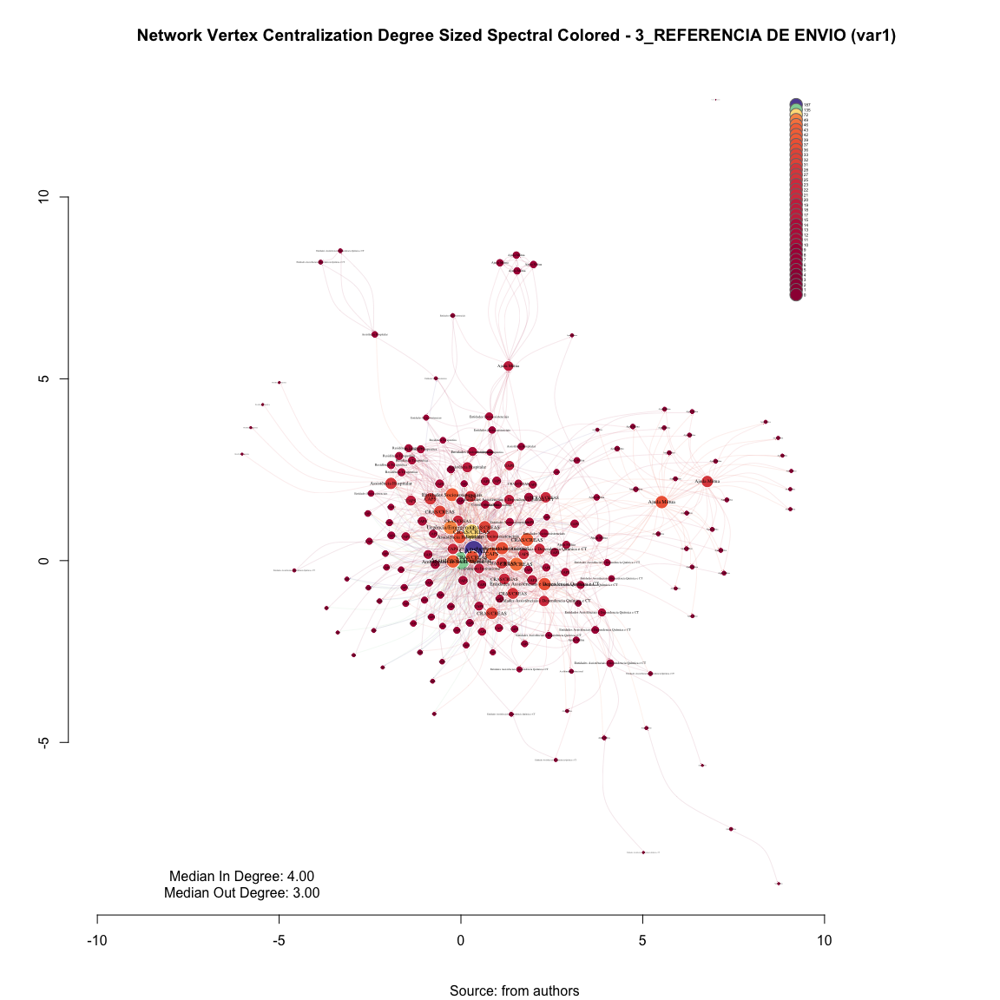<!-- -->

#Alternative vizualization using degree in order to genarete sub-graphs - Higher than median degree network

```r
#Set Seed
set.seed(124)

# Network elements with lower than meadian degree
higherthanmedian.network_var1<-V(var1)[degree(var1)<median(degree(var1))] 

#Deleting vertices based in intersection betewenn var1 
high_var1<-delete.vertices(var1, higherthanmedian.network_var1)

#Plotting based only on degree measures 
edge.start <- ends(high_var1, es=E(high_var1), names=F)[,1]

# Fixing ego
minC <- rep(-Inf, vcount(high_var1))
maxC <- rep(Inf, vcount(high_var1))
minC[1] <- maxC[1] <- 0
co <- layout_with_fr(high_var1, niter=10000, minx=minC, maxx=maxC,miny=minC, maxy=maxC, weights = E(high_var1)$weight)

#PLotting
plot(high_var1, 
     layout=co,
     edge.color=V(high_var1)$color[edge.start],
     edge.arrow.size=(degree(high_var1)+1)/1000,
     edge.width=E(high_var1)$weight/10,
     edge.curved = TRUE,
     vertex.size=log((V(high_var1)$var1_centr_degree+2))*10,
     vertex.frame.color="#ffffff",
     vertex.label.color="black",
     vertex.label=get.vertex.attribute(high_var1,"LABEL_COR"),
     vertex.label.cex=log((degree(high_var1)+2))/10,
     vertex.label.dist=0,
     rescale=F,
     xlim=range(co[,1]), 
     ylim=range(co[,2]))
axis(1)
axis(2)


#Solving Problems with legend rendering 
a<-V(high_var1)$LABEL_COR
b<-V(high_var1)$color
c<-table(a,b)
d<-as.data.frame(c)
e<-subset(d, d$Freq>0)
f<-t(e$a)
g<-t(e$b)

#Adding Legend
legend(x=range(co[,1])[2], y=range(co[,2])[2],
       legend=as.character(f),
       pch=21,
       col = "#777777", 
       pt.bg=as.character(g),
       pt.cex=3,
       bty="n", 
       ncol=1,
       lty=1,
       cex = .5)

#Adding Title
  title("Network Higher Than Median Degree - 3_REFERENCIA DE ENVIO (var1)", sub = "Source: from authors ")
  text(x=range(co[,1])[1], y=range(co[,2])[1], labels = 
   sprintf("Mean In Degree: %.2f\n Mean Out Degree: %.2f",
     mean(degree(high_var1, mode="in")), 
     mean(degree(high_var1, mode="out"))
   )
  )
```

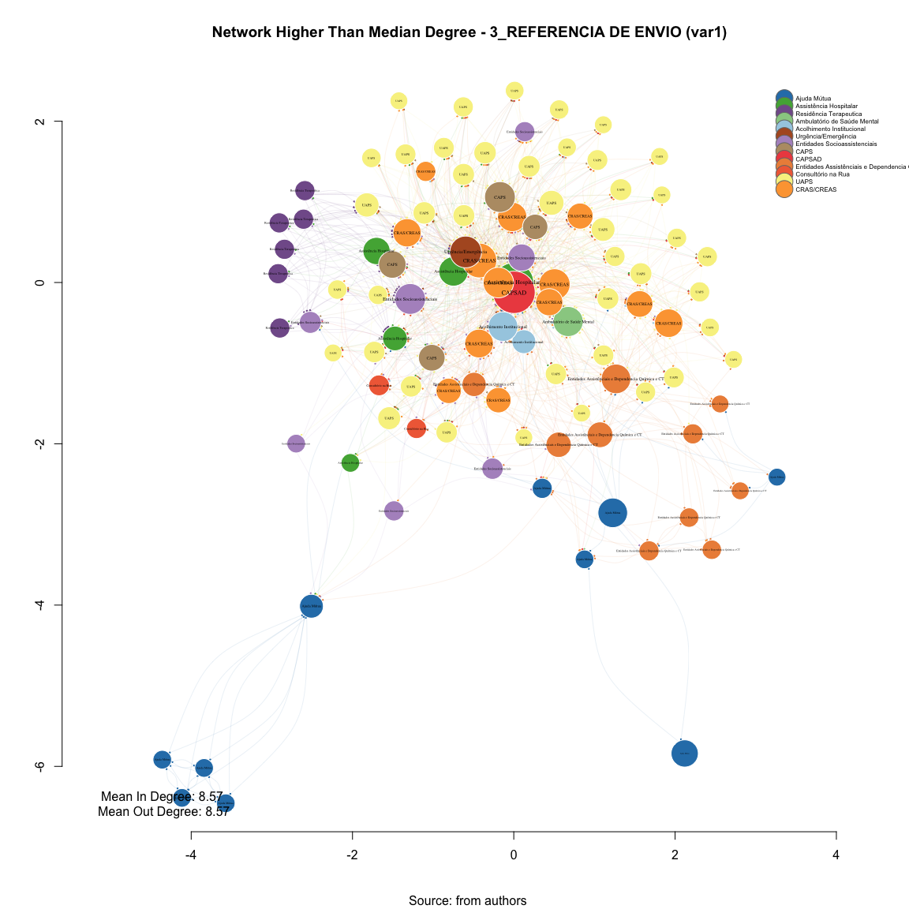<!-- -->

#Alternative vizualization using degree in order to genarete sub-graphs - Lower than median degree network 

```r
#Set Seed
set.seed(123)

# Network elements with lower than meadian degree
lowerthanmedian.network_var1<-V(var1)[degree(var1)>median(degree(var1))] 

#Deleting vertices based in intersection betewenn var1 
small_var1<-delete.vertices(var1, lowerthanmedian.network_var1)

#Plotting based only on degree measures 
edge.start <- ends(small_var1, es=E(small_var1), names=F)[,1]

# Fixing ego
minC <- rep(-Inf, vcount(small_var1))
maxC <- rep(Inf, vcount(small_var1))
minC[1] <- maxC[1] <- 0
co <- layout_with_fr(small_var1, niter=10000, minx=minC, maxx=maxC,miny=minC, maxy=maxC, weights = E(small_var1)$weight)

#PLotting
plot(small_var1, 
     layout=co,
     edge.color=V(small_var1)$color[edge.start],
     edge.arrow.size=(degree(small_var1)+1)/1000,
     edge.width=E(small_var1)$weight/10,
     edge.curved = TRUE,
     vertex.size=log((V(small_var1)$var1_centr_degree+2))*20,
     vertex.frame.color="#ffffff",
     vertex.label.color="black",
     vertex.label=get.vertex.attribute(small_var1,"LABEL_COR"),
     vertex.label.cex=log((degree(small_var1)+2))/3,
     vertex.label.dist=0,
     rescale=F,
     xlim=range(co[,1]), 
     ylim=range(co[,2]))
axis(1)
axis(2)

#Solving Problems with legend rendering 
a<-V(small_var1)$LABEL_COR
b<-V(small_var1)$color
c<-table(a,b)
d<-as.data.frame(c)
e<-subset(d, d$Freq>0)
f<-t(e$a)
g<-t(e$b)

#Adding Legend
legend(x=range(co[,1])[2], y=range(co[,2])[2],
       legend=as.character(f),
       pch=21,
       col = "#777777", 
       pt.bg=as.character(g),
       pt.cex=4,
       bty="n", 
       ncol=1,
       lty=1,
       cex = .5)

#Adding Title
  title("Network Smaller Than Median Degree - 3_REFERENCIA DE ENVIO (var1)", sub = "Source: from authors ")
  text(x=range(co[,1])[1], y=range(co[,2])[1], labels = 
   sprintf("Mean In Degree: %.2f\nMean Out Degree: %.2f",
     mean(degree(small_var1, mode="in")), 
     mean(degree(small_var1, mode="out"))
   )
  )
```

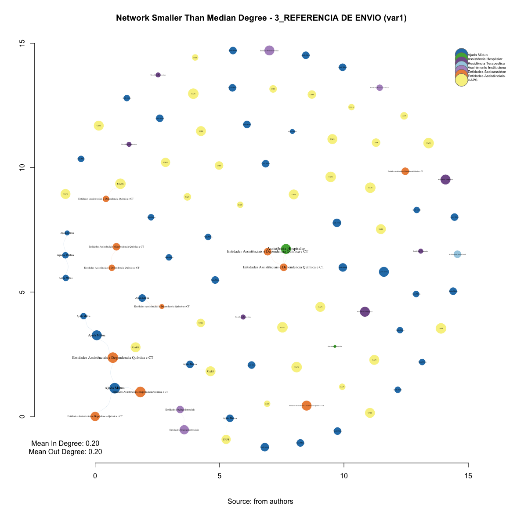<!-- -->

#Plotting using Average Neighbor Degree

```r
#Set Seed
set.seed(124)

#Plotting based only on degree measures 
edge.start <- ends(var1, es=E(var1), names=F)[,1]

# Fixing ego
minC <- rep(-Inf, vcount(var1))
maxC <- rep(Inf, vcount(var1))
minC[1] <- maxC[1] <- 0
co <- layout_with_fr(var1, niter=10000, minx=minC, maxx=maxC,miny=minC, maxy=maxC, weights = E(var1)$weight)

#Plotting based only on degree measures  #var1_a.nn.deg
V(var1)$var1_a.nn.deg<-as.numeric(graph.knn(var1)$knn)
V(var1)$var1_a.nn.deg[V(var1)$var1_a.nn.deg=="NaN"]<-0

#PLotting
plot(high_var1, 
     layout=co,
     edge.color=V(var1)$color[edge.start],
     edge.arrow.size=sqrt((V(var1)$var1_a.nn.deg)^2+1)/1000,
     edge.width=E(var1)$weight/100,
     edge.curved = TRUE,
     vertex.color=V(var1)$color,
     vertex.size=(sqrt((V(var1)$var1_a.nn.deg)^2))/5,
     vertex.frame.color="#ffffff",
     vertex.label.color="black",
     vertex.label=get.vertex.attribute(var1,"LABEL_COR"),
     vertex.label.cex=(sqrt((V(var1)$var1_a.nn.deg)^2)+1)/500,
     vertex.label.dist=0,
     rescale=F,
     xlim=range(co[,1]), 
     ylim=range(co[,2]))
axis(1)
axis(2)


#Solving Problems with legend rendering 
a<-V(var1)$LABEL_COR
b<-V(var1)$color
c<-table(a,b)
d<-as.data.frame(c)
e<-subset(d, d$Freq>0)
f<-t(e$a)
g<-t(e$b)

#Adding Legend
legend(x=range(co[,1])[2], y=range(co[,2])[2],
       legend=as.character(f),
       pch=21,
       col = "#777777", 
       pt.bg=as.character(g),
       pt.cex=4,
       bty="n", 
       ncol=1,
       lty=1,
       cex = .5)

#Adding Title
  title("Network Average Neighbor Degree Sized - 3_REFERENCIA DE ENVIO (var1)", sub = "Source: from authors ")
  text(x=range(co[,1])[1], y=range(co[,2])[1], labels = 
   sprintf("Median Average Neighbor Degree: %.2f",
     median((var1_a.nn.deg+1))
   ))
```

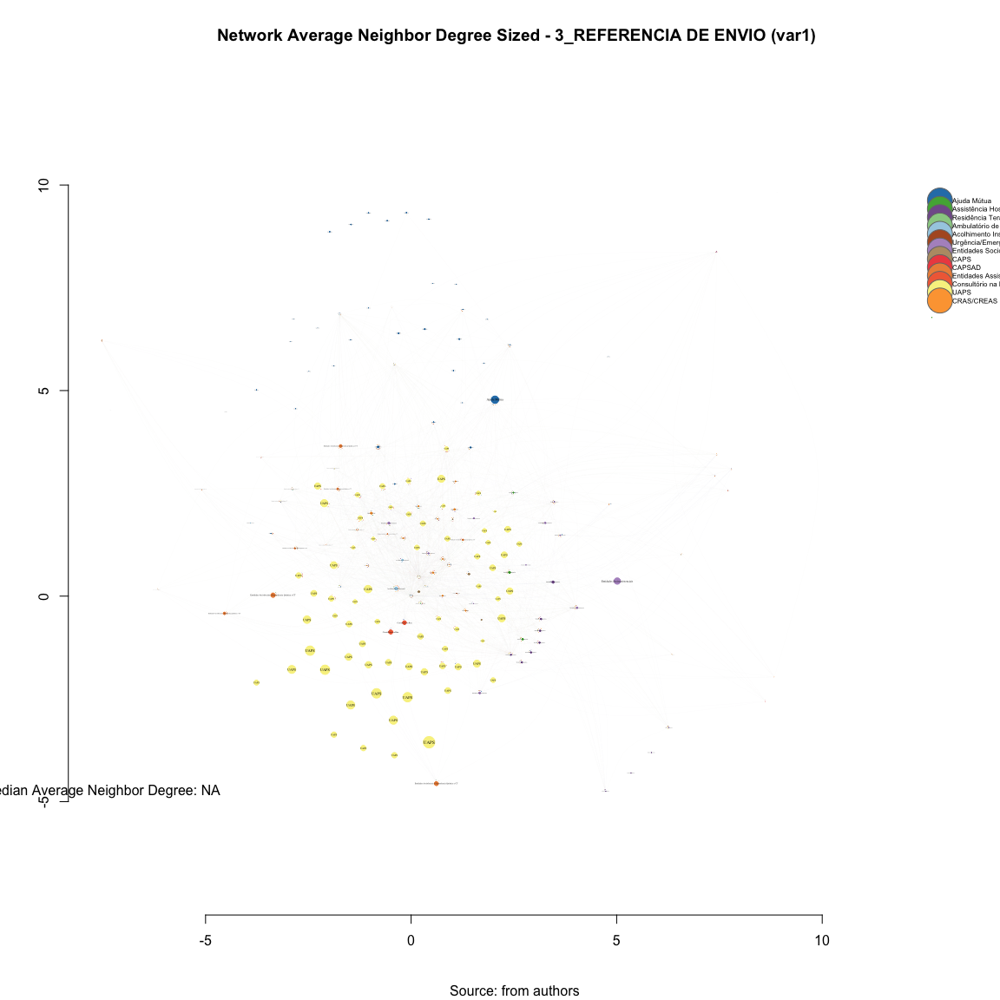<!-- -->

#Plotting using Average Neighbor Degree

```r
#Set Seed
set.seed(124)

#Plotting based only on degree measures 
edge.start <- ends(var1, es=E(var1), names=F)[,1]

# Fixing ego
minC <- rep(-Inf, vcount(var1))
maxC <- rep(Inf, vcount(var1))
minC[1] <- maxC[1] <- 0
co <- layout_with_fr(var1, niter=10000, minx=minC, maxx=maxC,miny=minC, maxy=maxC, weights = E(var1)$weight)


#Plotting based only on degree measures  #var1_a.nn.deg
V(var1)$var1_a.nn.deg_w<-as.numeric(graph.knn(var1, weights = E(var1)$weight)$knn)
V(var1)$var1_a.nn.deg_w[V(var1)$var1_a.nn.deg_w=="NaN"]<-0

#PLotting
plot(high_var1, 
     layout=co,
     edge.color=V(var1)$color[edge.start],
     edge.arrow.size=sqrt((V(var1)$var1_a.nn.deg_w)^2+1)/1000,
     edge.width=E(var1)$weight/100,
     edge.curved = TRUE,
     vertex.color=V(var1)$color,
     vertex.size=(sqrt((V(var1)$var1_a.nn.deg_w)^2))/5,
     vertex.frame.color="#ffffff",
     vertex.label.color="black",
     vertex.label=get.vertex.attribute(var1,"LABEL_COR"),
     vertex.label.cex=(sqrt((V(var1)$var1_a.nn.deg_w)^2)+1)/500,
     vertex.label.dist=0,
     rescale=F,
     xlim=range(co[,1]), 
     ylim=range(co[,2]))
axis(1)
axis(2)


#Solving Problems with legend rendering 
a<-V(var1)$LABEL_COR
b<-V(var1)$color
c<-table(a,b)
d<-as.data.frame(c)
e<-subset(d, d$Freq>0)
f<-t(e$a)
g<-t(e$b)

#Adding Legend
legend(x=range(co[,1])[2], y=range(co[,2])[2],
       legend=as.character(f),
       pch=21,
       col = "#777777", 
       pt.bg=as.character(g),
       pt.cex=4,
       bty="n", 
       ncol=1,
       lty=1,
       cex = .5)

#Adding Title
  title("Network Average Weighted Neighbor Degree Sized - 3_REFERENCIA DE ENVIO (var1)", sub = "Source: from authors ")
  text(x=range(co[,1])[1], y=range(co[,2])[1], labels = 
   sprintf("Median Average Weighted Neighbor Degree: %.2f",
     median((var1_a.nn.deg_w+1))
   ))
```

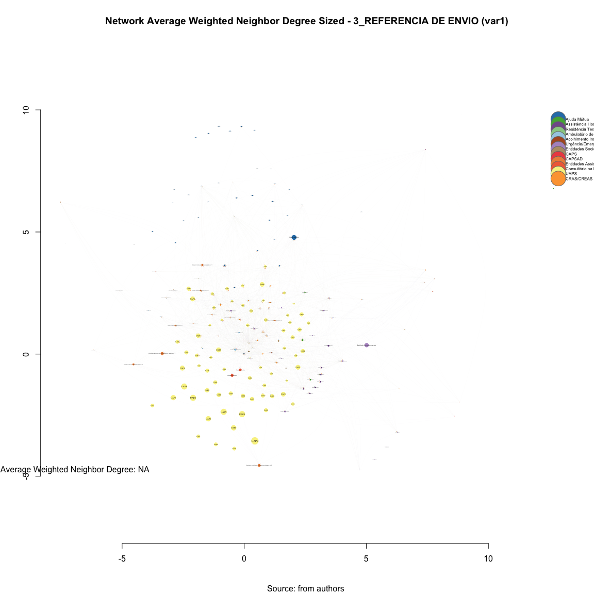<!-- -->

#Circle Degree ***Too intensive computation*** #code

```r
#Circle Degree ***Too intense computation***
#A_var1 <- get.adjacency(var1, sparse=FALSE)
#detach("package:igraph", unload=TRUE)
#library(network)
#g <- network::as.network.matrix(A_var1)
#library(sna)
#gplot.target(g, degree(g), main="Circle Degree")
#library(igraph)
```

#Saving objects with new variables and changes

```r
save.image("~/SNArRDJF/Robject/2_degree_var1.RData")
```


